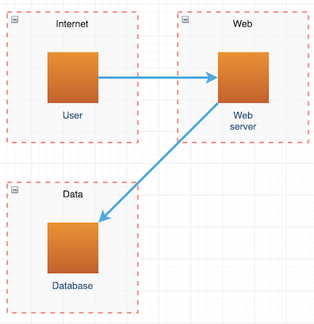
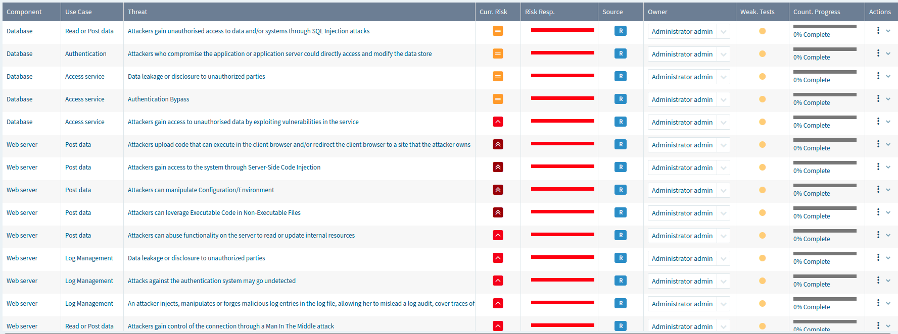

# IriusRisk StartLeft

Parse IaC and other files to the Open Threat Model format and upload them to IriusRisk.

Note: This software is early release and is provided as-is.

# Installation

```
pip install git+https://github.com/iriusrisk/startleft.git
```

# Usage

## Command line client

You'll need to export two enviroment variables. The first is the IriusRisk server which should include protocol and hostname (with optional port) but not path. The second is your API token.

```
$ export IRIUS_SERVER=https://instance.iriusrisk.com
$ export IRIUS_API_TOKEN=123-123-123-123-123
```

For help, just run startleft without any arguments.

```
$ startleft
Usage: startleft [OPTIONS] COMMAND [ARGS]...

  Parse IaC and other files to the Open Threat Model format and upload them to
  IriusRisk

Options:
  -l, --log-level TEXT      Set the log level. Must be one of: crit, error,
                            warn, info, debug, none.
  --verbose / --no-verbose  Makes logging more verbose.
  --version                 Show the version and exit.
  --help                    Show this message and exit.

Commands:
  parse        Parses IaC source files into Open Threat Model
  run          Parses IaC source files into Open Threat Model and...
  search       Searches source files for the given query
  threatmodel  Uploads an OTM file to IriusRisk
  validate     Validates a mapping or OTM file
  server       Launches the REST server in development mode
```

You can also get help for the specific commands.

```
$ startleft run --help
Usage: startleft run [OPTIONS] [FILENAME]...

  Parses IaC source files into Open Threat Model and immediately uploads
  threat model to IriusRisk

Options:
  -t, --type                      [JSON|YAML|CloudFormation|HCL2|Terraform]
                                  Specify the source file type.
  -m, --map TEXT                  Map file to use when parsing source files
  -o, --otm TEXT                  OTM output file name
  -n, --name TEXT                 Project name
  --id TEXT                       Project ID
  --recreate / --no-recreate      Delete and recreate the product each time
  --irius-server                  IriusRisk server to connect to (proto://server[:port])'
  --api-token                     IriusRisk API token
  --help                          Show this message and exit.
```

## API server

StartLeft can also be deployed as a standalone webserver if you prefer the communication via API. If you want to use the server option on the application:

```
$ startleft server --help
Usage: startleft server [OPTIONS]...

  Launches the REST server in development mode to test the API

Options:
  --irius-server                  IriusRisk server to connect to (proto://server[:port])'
  --port                          The port to deploy this application to
  --help                          Show this message and exit.

```

You should see a message like "Uvicorn running on http://127.0.0.1:5000 (Press CTRL+C to quit)" and after that you will be able to access the application via API. You can see the endpoints provided by opening the following URL in a web browser: http://127.0.0.1:5000/docs

Available endpoints:
```
GET /health
```
```
POST /api/v1/startleft/cloudformation
Headers:
    api_token                   Required: IriusRisk API token
Request Body:
    cft_file:                   Required. File that contains the CloudFormation Template
    type                        Required. Format of the CloudFormation Template
    id                          Required. ID of the new project
    name                        Required. Name of the new project
    mapping_file                Optional. File that contains the mapping between AWS components and IriusRisk components. Providing this file will completely override default values
```
```
PUT /api/v1/startleft/cloudformation/projects/{project_id}
Headers:
    api_token                   Required: IriusRisk API token
Path parameter:
    project_id:                 Required. IriusRisk project identifier
Request Body:
    cft_file:                   Required. File that contains the CloudFormation Template
    type:                       Required. Format of the CloudFormation Template
    name                        Required. Name of the project to update
    mapping_file                Optional. File that contains the mapping between AWS components and IriusRisk components. Providing this file will completely override default values
```

# Examples

You can find some example source files inside the `examples` directory.

## Cloudformation

### ELB without a WAF

The following command will parse the cloudformation source file `elb-no-waf.json` creating a OTM file `elb-no-waf.otm` in the process.

```
startleft parse --type cloudformation --otm elb-no-waf.otm --name "CFT ELB No Waf" --id "cft-elb-no-waf" elb-no-waf.json
```
It is also possible to include your own mapping files, thus overriding the internal cloudformation mapper files:
```
startleft parse --type cloudformation --map cloudformation_mapping_file_1.yaml --map cloudformation_mapping_file_2.yaml --otm elb-no-waf.otm --name "CFT ELB No Waf" --id "cft-elb-no-waf" elb-no-waf.json
```
The next command takes the OTM file and generates an IriusRisk threat model which is uploaded to the server.
```
startleft threatmodel --recreate elb-no-waf.otm
```

For convenience, you can run the above two commands in one go:
```
startleft run --type cloudformation --otm elb-no-waf.otm --name "CFT ELB No Waf" --id "cft-elb-no-waf" --recreate elb-no-waf.json
```
Of course, it is also possible to use custom mapping files:
```
startleft run --type cloudformation --map defaults_map.yaml --map cloudformation_map.yaml --otm elb-no-waf.otm --name "CFT ELB No Waf" --id "cft-elb-no-waf" --recreate elb-no-waf.json
```

### ELB with a WAF

This example can be run in the same way, but this Cloudformation also includes a WAF and dataflow.

Parsing the Cloudformation.

```
startleft parse --type cloudformation --otm elb-with-waf.otm --name "CFT ELB With Waf" --id "cft-elb-with-waf" elb-with-waf.json
```

Uploading OTM to IriusRisk.

```
startleft threatmodel --recreate elb-with-waf.otm
```

Or both in one step.

```
startleft run --type cloudformation --otm elb-with-waf.otm --name "CFT ELB With Waf" --id "cft-elb-with-waf" --recreate elb-with-waf.json
```

## Terraform HCL2

StartLeft can also parse Terraform source files and an example is provided in the `examples` directory.

```
startleft run --type hcl2 --map defaults_map.yaml --map terraform_aws_map.yaml --otm elb.otm --name "Terraform ELB" --id "terraform-elb" --recreate elb.tf
```

## Hand crafted OTM

You can also write an OTM file without parsing any IaC source files. This is useful if you want to create a threat model in your IDE and have the diagram etc. generated for you. For example, the following short OTM file:

```
project:
  name: Manual ThreatModel
  id:   manual-threatmodel

trustzones:
  - id:   internet
    name: Internet
    type: internet

  - id:   web
    name: Web
    type: private

  - id:   data
    name: Data
    type: private

components:
  - id:     user
    name:   User
    type:   user
    parent: internet

  - id:     web-server
    name:   Web server
    type:   webapp
    parent: web

  - id:     database
    name:   Database
    type:   postgres
    parent: data

dataflows:
  - id:     client-connection
    name:   Client connection
    type:   network
    source:   user
    destination:     web-server

  - id:     database-connection
    name:   Database connection
    type:   network
    source:   web-server
    destination:     database
```

Will create this threat model in IriusRisk:





The example is provided and can be run using this command:

```
startleft threatmodel --recreate manual.otm
```


# Source Mapping

Source mapping files are basically additional logic around a collection of JMESPath queries which are used describe how to find components, dataflows, and trustzones in source file data structures. Source mapping files are made up of three main sections corresponding the main sections in an OTM file, plus a lookup section described below:

* trustzones
* components
* dataflows

Each contains a list of 0 or more objects that describe how to find the respective object in the source file, and each object has a number of required and optional fields. 

Take a look at the JSONSchema file for more details: https://github.com/iriusrisk/startleft/blob/main/startleft/data/mapping_schema.json

## JMESPath Queries

Special $action fields begin with a dollar sign ($) and do not directly contribute to the OTM output. Instead they specify an action and behaviour used to process the source files or generate the OTM output. 

This table describes each special $actions.

| $action         | Description                                                                                              | Example                                                                                                |
| --------------- | -------------------------------------------------------------------------------------------------------- | ------------------------------------------------------------------------------------------------------ |
| $source         | Specifies the source of the object type                                                                  | $source: {$root: "Resources&#124;squash(@)[?Type=='AWS::EC2::VPC']"}                                   |
| $root           | JMESPath search through the entire source file data structure                                            | $root: "Resources&#124;squash(@)[?Type=='AWS::EC2::VPC']"                                            |
| $path           | JMESPath search through the object identified in the $source. A default value is optional by using the $searchParams structure | $path: "Type" <br/>$path: "Properties.VpcId.Ref"<br/>$path: {$searchParams:{ searchPath: "Properties.SubnetId.Ref", defaultValue: "b61d6911-338d-46a8-9f39-8dcd24abfe91"}} |
| $findFirst      | JMESPath search through the list of objects identified in the $source and returning the first successful match. A default value is optional by using the $searchParams structure | $findFirst: ["Properties.FunctionName.Ref", "Properties.FunctionName"] <br/> $findFirst: {$searchParams:{ searchPath: ["Properties.SubnetId.Ref","Properties.SubnetId"], defaultValue: "b61d6911-338d-46a8-9f39-8dcd24abfe91"}} |
| $format         | A named format string based on the output of other $special fields. Note, only to be used for id fields. | $format: "{name}"                                                                                |
| $catchall       | A sub-field of $source, specifying a default search for all other objects not explicitly defined         | $catchall: {$root: "Resources&#124;squash(@)"}                                                         |
| $skip           | A sub-field of $source, specifying specific objects to skip if not explicitly defined                    | $skip: {$root: "Resources&#124;squash(@)[?Type=='AWS::EC2::Route']"}                                   |
| $singleton      | A sub-field of $source, specifying specific objects to be unified under a single component or trustzone  | $singleton: { $root: "Resources&#124;squash(@)[?Type=='AWS::SecretsManager::Secret']"} |
| $numberOfSources| When using singleton, allows you to set different values for output name or tags when the number of sources for the same mapping are single or multiple | $numberOfSources: {oneSource:{$path: "_key"}, multipleSource:{ $format: "CD-ACM (grouped)" }}|
| $altsource      | Specifies an alternative mapping when $source returns no object. | $altsource:<br/>       - $mappingType: {$root: "Resources&#124;squash(@)[?Type=='AWS::EC2::VPCEndpoint']"}<br/>         $mappingPath: {$path: "Properties.ServiceName"}<br/>         $mappingLookups:<br/>           - regex: ^(.*)s3$<br/>             name: S3 from VPCEndpoint<br/>             type: s3|
| $lookup         | Allows you to look up the output of a $special field against a key-value lookup table                    | $lookup:   {path: "Properties.Subnets[]&#124;map(&values(@), @)[]&#124;map(&re_sub('[:]', '-', @), @)"} |


For more information on how to create a JMESPath search query, checkout the website: https://jmespath.org/

## Hardcoded values

In addition to using $source and other special $actions, you can also just hardcode values which will be taken and mapped as is. For example, you may want to specify a default trustzone which wouldn't be found anywhere in the source files. You can do this easily just by adding it to a mapping file:

```
trustzones:
  - id:   default-zone
    name: Default
```

## Lookup table

A simple lookup key-value table section can be added to the mapping file. This is useful if there are inconsistencies in naming conventions used, and you need to be able to translate one name into another.

For example, if we have a situation where a subnet name is written using a short naming convention, but is actually referred to via a longer name elsewhere, we can use the $lookup action.

```
parent:
  $lookup: {$path: "Properties.Subnets[]|map(&values(@), @)[]|map(&re_sub('[:]', '-', @), @)"}
```

If the above query returns a subnet called `shortnameA`, then it will be looked up in the below table:

```
lookup:
  shortnameA: amuchlongernameA
  shortnameB: amuchlongernameB
```

To give a final value of `amuchlongernameA`.

## Additional JMESPath functions

This tool extends the standard JMESPath functions with a couple of extra ones that are particularly useful when parsing Cloudformation due to how cloudformation files are structured.

### re_sub
The `re_sub` function replaces the occurances of `pattern` with `replace` in the given `string`. 

```
def _func_re_sub(self, pattern, replace, s):
```

For example we may want to replace colon characters with hyphens such as in `lookup: {path: "Properties.Subnets[]|map(&values(@), @)[]|map(&re_sub('[:]', '-', @), @)"}`.

### squash
The `squash` function takes a nested object of objects, and sqashes them into a list of objects, injecting the parent "key" to the child object as "_key".

```
def _func_squash(self, obj):
```

In cloudformation, Resources is an object where to top level keys are the resource names which have the resource objects as values. This structure is hard to iterate over without losing the important name key. So you can use sqash and refer to the name through the `_key` field.

```
name:    {$path: "_key"}
$source: {$root: "Resources|squash(@)[?Type=='AWS::EC2::Subnet']"}
```

# OTM Mapping
