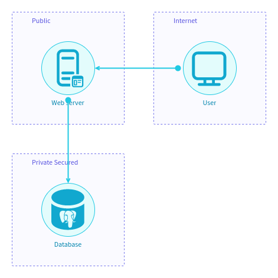

IriusRisk StartLeft
===================
Parses IaC and other files to the Open Threat Model format and uploads them to IriusRisk.

Note: This software is early release and is provided as-is.

# Installation

```
pip install git+https://github.com/iriusrisk/startleft.git
```

# Usage

## Command line client 

You'll need to export two enviroment variables. The first is the IriusRisk server which should include protocol and hostname (with optional port) but not path. The second is your API token.

```
$ export IRIUS_SERVER=https://instance.iriusrisk.com
$ export IRIUS_API_TOKEN=123-123-123-123-123
```
The alternative is to include those values as command-line parameters `--irius-server` and `--api-token`, respectively. 

For help, just run `startleft without any arguments.

```
$ startleft
Usage: startleft [OPTIONS] COMMAND [ARGS]...

  Parse IaC files to the Open Threat Model format and upload them to IriusRisk

Options:
  -l, --log-level TEXT      Set the log level. Must be one of: crit, error,
                            warn, info, debug, none.
  --verbose / --no-verbose  Makes logging more verbose.
  --version                 Show the version and exit.
  --help                    Show this message and exit.

Commands:
  parse        Parses IaC files to the Open Threat Model format
  run          Parses IaC files to the Open Threat Model format and...
  search       Searches source files for the given query
  server       Launches a REST server to receive and parse IaC files,...
  threatmodel  Uploads an OTM file to IriusRisk
  validate     Validates a mapping or OTM file
```

You can also get help for the specific commands.

```
$ startleft run --help
Usage: startleft run [OPTIONS] [FILENAME]...

  Parses IaC files to the Open Threat Model and upload them to 
  IriusRisk

Options:
  -t, --type  [JSON|YAML|CloudFormation|HCL2|Terraform]
                                  Specify the source file type.
  -m, --map TEXT                  Map file to use when parsing source files
  -o, --otm TEXT                  OTM output file name
  -n, --name TEXT                 Project name
  --id TEXT                       Project ID
  --recreate / --no-recreate      Delete and recreate the product each time
  --irius-server TEXT             IriusRisk server to connect to
                                  (proto://server[:port])'
  --api-token  TEXT               IriusRisk API token
  --help                          Show this message and exit.
```

## API server

StartLeft can also be deployed as a standalone webserver if you prefer the communication via API. If you want to use the server option on the application:

```
$ startleft server --help
Usage: startleft server [OPTIONS]...

  Launches a REST server to receive and parse IaC files, finally uploading
  resultant OTM files to IriusRisk

Options:
  --port INTEGER                  The port to deploy this application to
  --irius-server TEXT             IriusRisk server to connect to (proto://server[:port])
  --help                          Show this message and exit.

```

By executing `startleft server` it is possible to see the command-line messages finishing with the following:

```Uvicorn running on http://127.0.0.1:5000 (Press CTRL+C to quit)```

so indicating Startleft's REST API is ready. You can see the endpoints provided by opening the following URL in a web browser: http://127.0.0.1:5000/docs

Available endpoints:
```
GET /health
```
```
POST /api/v1/startleft/cloudformation
Headers:
    api_token                   Required: IriusRisk API token
Request Body:
    cft_file:                   Required. File that contains the CloudFormation Template
    type                        Required. Format of the CloudFormation Template
    id                          Required. ID of the new project
    name                        Required. Name of the new project
    mapping_file                Optional. File that contains the mapping between AWS components and IriusRisk components. Providing this file will completely override default values
```
```
PUT /api/v1/startleft/cloudformation/projects/{project_id}
Headers:
    api_token                   Required: IriusRisk API token
Path parameter:
    project_id:                 Required. IriusRisk project identifier
Request Body:
    cft_file:                   Required. File that contains the CloudFormation Template
    type:                       Required. Format of the CloudFormation Template
    name                        Required. Name of the project to update
    mapping_file                Optional. File that contains the mapping between AWS components and IriusRisk components. Providing this file will completely override default values
```

# Examples

You can find some example source files inside the `examples` directory:

* `examples/cloudformation` contains CloudFormation Template example files to convert into OTM format.

* `examples/manual` contains the OTM example file detailed in [Hand Crafted OTM](#hand-crafted-OTM).

* `examples/terraform` contains Terraform example files to convert into OTM format. 

## Cloudformation

### ELB without a WAF

The following command will parse the cloudformation source file `elb-no-waf.json` creating a OTM file `elb-no-waf.otm` in the process.

```
startleft parse --type cloudformation --otm elb-no-waf.otm --name "CFT ELB No Waf" --id "cft-elb-no-waf" elb-no-waf.json
```
It is also possible to include your own mapping file or files, thus overriding the default internal cloudformation mapper file:
```
startleft parse --type cloudformation --map cloudformation_mapping_file_1.yaml --map cloudformation_mapping_file_2.yaml --otm elb-no-waf.otm --name "CFT ELB No Waf" --id "cft-elb-no-waf" elb-no-waf.json
```
The next command takes the OTM file and generates an IriusRisk threat model which is uploaded to the server.
```
startleft threatmodel --recreate elb-no-waf.otm
```

For convenience, `parse` and `threatmodel` can be `run` in one go:
```
startleft run --type cloudformation --otm elb-no-waf.otm --name "CFT ELB No Waf" --id "cft-elb-no-waf" --recreate elb-no-waf.json
```
Of course, it is also possible to parse by using custom mapping files with `run`:
```
startleft run --type cloudformation --map defaults_map.yaml --map cloudformation_map.yaml --otm elb-no-waf.otm --name "CFT ELB No Waf" --id "cft-elb-no-waf" --recreate elb-no-waf.json
```
Note: with `threatmodel` or `run` commands it is mandatory to include the IriusRisk API token and IriusRisk URL via environment variables or as command-line arguments, as shown in [Command Line Client](#command-line-client). 
### ELB with a WAF

This example can be run in the same way, but this Cloudformation also includes a WAF.

Parsing the Cloudformation template file:

```
startleft parse --type cloudformation --otm elb-with-waf.otm --name "CFT ELB With Waf" --id "cft-elb-with-waf" elb-with-waf.json
```

Uploading OTM file to IriusRisk:

```
startleft threatmodel --recreate elb-with-waf.otm
```

Or both commands in one step:

```
startleft run --type cloudformation --otm elb-with-waf.otm --name "CFT ELB With Waf" --id "cft-elb-with-waf" --recreate elb-with-waf.json
```

## Terraform HCL2

StartLeft can also parse Terraform source files and an example is provided in the `examples` directory.

```
startleft run --type hcl2 --map defaults_map.yaml --map terraform_aws_map.yaml --otm elb.otm --name "Terraform ELB" --id "terraform-elb" --recreate elb.tf
```

## Hand crafted OTM

You can also write an OTM file without parsing any IaC source files. This is useful if you want to create a threat model in your IDE and have the diagram etc. generated for you. For example, the following short OTM file:

```
otmVersion: 0.1.0

project:
  name: Manual ThreatModel
  id:   manual-threatmodel

trustZones:
  - id:   f0ba7722-39b6-4c81-8290-a30a248bb8d9
    name: Internet
    risk:
      trustRating: 1

  - id:   6376d53e-6461-412b-8e04-7b3fe2b397de
    name: Public
    risk:
      trustRating: 1

  - id:   2ab4effa-40b7-4cd2-ba81-8247d29a6f2d
    name: Private Secured
    risk:
      trustRating: 100

components:
  - id:     user
    name:   User
    type:   generic-client
    parent:
      trustZone: f0ba7722-39b6-4c81-8290-a30a248bb8d9

  - id:     web-server
    name:   Web server
    type:   web-application-server-side
    parent:
      trustZone: 6376d53e-6461-412b-8e04-7b3fe2b397de

  - id:     database
    name:   Database
    type:   postgresql
    parent:
      trustZone: 2ab4effa-40b7-4cd2-ba81-8247d29a6f2d

dataflows:
  - id:     client-connection
    name:   Client connection
    source:   user
    destination:   web-server

  - id:     database-connection
    name:   Database connection
    source:   web-server
    destination:     database
```

Will create this threat model in IriusRisk:




The example is provided and can be run using this command:

```
startleft threatmodel --recreate manual.otm
```


# Source Mapping
All the info is available at: https://github.com/iriusrisk/startleft/wiki/Source-Mapping

# Open Threat Model (OTM)
See GitHub wiki: https://github.com/iriusrisk/startleft/wiki/Open-Threat-Model-(OTM) 
