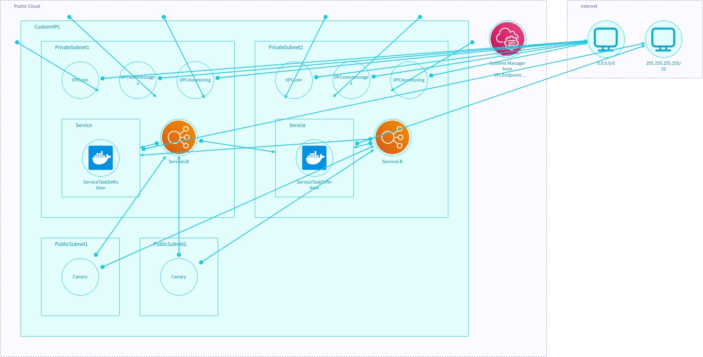

## Open Threat Model standard

The `Open Threat Modeling Format (OTM)` defines a platform independent way to define the threat model of any system.
It’s a simple and tool agnostic `YAML` (or `JSON`) format that describes the essential 
elements and properties of a threat model and which allows to understand what are the components of a system, 
how are they distributed, the security risks that could be exposed to attackers and the mitigations that could be 
implemented to avoid those vulnerabilities (see [https://www.iriusrisk.com/resources-blog/introduction-to-the-open-threat-model-standard](https://www.iriusrisk.com/resources-blog/introduction-to-the-open-threat-model-standard)).


A detailed description about the standard is included in the <a href= "https://github.com/iriusrisk/OpenThreatModel#readme" target="_blank">OTM Project</a>.

### Format

An `OTM` document is itself a JSON object, which may be represented either in JSON or YAML format.
All field names in the specification are case-sensitive. This includes all fields that are used as keys in a map.

The specification follows the same approach to JSON formats as the OpenAPI specification. See 
<a href= "https://swagger.io/specification/" target="_blank"> the Swagger specification </a> for more information.

???+ example "Manual OTM example"

    ```otm
        otmVersion: 0.1.0
        project:
          name: Manual ThreatModel
          id:   manual-threatmodel
        trustZones:
          - id:   f0ba7722-39b6-4c81-8290-a30a248bb8d9
            name: Internet
            risk:
            trustRating: 1
          - id:   6376d53e-6461-412b-8e04-7b3fe2b397de
            name: Public
            risk:
            trustRating: 1
          - id:   2ab4effa-40b7-4cd2-ba81-8247d29a6f2d
            name: Private Secured
            risk:
            trustRating: 100
        components:
          - id:     user
            name:   User
            type:   generic-client
            parent:
            trustZone: f0ba7722-39b6-4c81-8290-a30a248bb8d9
          - id:     web-server
            name:   Web server
            type:   web-application-server-side
            parent:
            trustZone: 6376d53e-6461-412b-8e04-7b3fe2b397de
          - id:     database
            name:   Database
            type:   postgresql
            parent:
            trustZone: 2ab4effa-40b7-4cd2-ba81-8247d29a6f2d
        dataflows:
          - id:     client-connection
            name:   Client connection
            source:   user
            destination:   web-server
            - id:     database-connection
            name:   Database connection
            source:   web-server
            destination:     database
    ```
### Schema

The OTM object `schema` is as follows:

| Field            | Type                                                                                                                      | Description                                                                                                                                                                                |
|------------------|---------------------------------------------------------------------------------------------------------------------------|--------------------------------------------------------------------------------------------------------------------------------------------------------------------------------------------|
| otmVersion       | String                                                                                                                    | REQUIRED This field states the OTM version used in the current file. It is an important field in order to ensure backwards compatibility.                                                  |
| project          | <a href= "https://github.com/iriusrisk/OpenThreatModel#project-object" target="_blank">Project object</a>                 | REQUIRED The project node represents the entity within all the other elements are grouped. It's the unit of work.                                                                          |
| representations  | <a href= "https://github.com/iriusrisk/OpenThreatModel#representations-object" target="_blank">Representations object</a> | Representations define different ways in which the project may be represented. Representation is an abstract concept and there might be several implementations.                           |
| assets           | <a href= "https://github.com/iriusrisk/OpenThreatModel#assets-object" target="_blank">Assets object</a>                   | Assets are the different kinds of sensible information that take part in our threat model.                                                                                                 |
| components       | <a href= "https://github.com/iriusrisk/OpenThreatModel#components-object" target="_blank">Components object</a>           | Components are the different pieces of software / hardware that make up our project.                                                                                                       |
| dataflows        | <a href= "https://github.com/iriusrisk/OpenThreatModel#dataflows-object" target="_blank">DataFlows object</a>             | Data flows are the elements that describe the movement of relevant information (assets) across our architecture.                                                                           |
| trustZones       | <a href= "https://github.com/iriusrisk/OpenThreatModel#trustzones-object" target="_blank">TrustZones object</a>           | Trust zones are the different areas within which components are located. They define how trustworthy an area is, based on how accessible it is: the more accessible, the less trustworthy. |
| threats          | <a href= "https://github.com/iriusrisk/OpenThreatModel#threats-object" target="_blank">Threats object</a>                 | Threats are the undesirable outcomes that can occur in our system and that we want to prevent.                                                                                             |
| mitigations      | <a href= "https://github.com/iriusrisk/OpenThreatModel#mitigations-object" target="_blank">Mitigations object</a>         | Mitigations are the actions that we can take (or controls that we can put in place) in order to prevent a threat from taking place.                                                        |

### Open Threat Model examples

Some examples of `otm` files are shown below, along with the project that each one generates.

??? success "Cloudformation project example"

    === "OTM file"
        ```otm
            {
              "otmVersion": "0.1.0",
              "project": {
                "name": "cft_multiple_files_project",
                "id": "cft_multiple_files_project_id"
              },
              "representations": [
                {
                  "name": "CloudFormation",
                  "id": "CloudFormation",
                  "type": "code"
                }
              ],
              "trustZones": [
                {
                  "id": "b61d6911-338d-46a8-9f39-8dcd24abfe91",
                  "name": "Public Cloud",
                  "risk": {
                    "trustRating": 10
                  }
                },
                {
                  "id": "f0ba7722-39b6-4c81-8290-a30a248bb8d9",
                  "name": "Internet",
                  "risk": {
                    "trustRating": 10
                  }
                }
              ],
              "components": [
                {
                  "id": "b61d6911-338d-46a8-9f39-8dcd24abfe91.customvpc",
                  "name": "CustomVPC",
                  "type": "vpc",
                  "parent": {
                    "trustZone": "b61d6911-338d-46a8-9f39-8dcd24abfe91"
                  },
                  "tags": [
                    "AWS::EC2::VPC"
                  ]
                },
                {
                  "id": "b61d6911-338d-46a8-9f39-8dcd24abfe91.customvpc.privatesubnet1",
                  "name": "PrivateSubnet1",
                  "type": "empty-component",
                  "parent": {
                    "component": "b61d6911-338d-46a8-9f39-8dcd24abfe91.customvpc"
                  },
                  "tags": [
                    "AWS::EC2::Subnet"
                  ]
                },
                {
                  "id": "b61d6911-338d-46a8-9f39-8dcd24abfe91.customvpc.privatesubnet2",
                  "name": "PrivateSubnet2",
                  "type": "empty-component",
                  "parent": {
                    "component": "b61d6911-338d-46a8-9f39-8dcd24abfe91.customvpc"
                  },
                  "tags": [
                    "AWS::EC2::Subnet"
                  ]
                },
                {
                  "id": "b61d6911-338d-46a8-9f39-8dcd24abfe91.customvpc.publicsubnet1",
                  "name": "PublicSubnet1",
                  "type": "empty-component",
                  "parent": {
                    "component": "b61d6911-338d-46a8-9f39-8dcd24abfe91.customvpc"
                  },
                  "tags": [
                    "AWS::EC2::Subnet"
                  ]
                },
                {
                  "id": "b61d6911-338d-46a8-9f39-8dcd24abfe91.customvpc.publicsubnet2",
                  "name": "PublicSubnet2",
                  "type": "empty-component",
                  "parent": {
                    "component": "b61d6911-338d-46a8-9f39-8dcd24abfe91.customvpc"
                  },
                  "tags": [
                    "AWS::EC2::Subnet"
                  ]
                },
                {
                  "id": "b61d6911-338d-46a8-9f39-8dcd24abfe91.customvpc.privatesubnet1.vpcssm",
                  "name": "VPCssm",
                  "type": "empty-component",
                  "parent": {
                    "component": "b61d6911-338d-46a8-9f39-8dcd24abfe91.customvpc.privatesubnet1"
                  },
                  "tags": [
                    "AWS::EC2::VPCEndpoint"
                  ]
                },
                {
                  "id": "b61d6911-338d-46a8-9f39-8dcd24abfe91.customvpc.privatesubnet2.vpcssm",
                  "name": "VPCssm",
                  "type": "empty-component",
                  "parent": {
                    "component": "b61d6911-338d-46a8-9f39-8dcd24abfe91.customvpc.privatesubnet2"
                  },
                  "tags": [
                    "AWS::EC2::VPCEndpoint"
                  ]
                },
                {
                  "id": "b61d6911-338d-46a8-9f39-8dcd24abfe91.customvpc.privatesubnet1.vpcssmmessages",
                  "name": "VPCssmmessages",
                  "type": "empty-component",
                  "parent": {
                    "component": "b61d6911-338d-46a8-9f39-8dcd24abfe91.customvpc.privatesubnet1"
                  },
                  "tags": [
                    "AWS::EC2::VPCEndpoint"
                  ]
                },
                {
                  "id": "b61d6911-338d-46a8-9f39-8dcd24abfe91.customvpc.privatesubnet2.vpcssmmessages",
                  "name": "VPCssmmessages",
                  "type": "empty-component",
                  "parent": {
                    "component": "b61d6911-338d-46a8-9f39-8dcd24abfe91.customvpc.privatesubnet2"
                  },
                  "tags": [
                    "AWS::EC2::VPCEndpoint"
                  ]
                },
                {
                  "id": "b61d6911-338d-46a8-9f39-8dcd24abfe91.customvpc.privatesubnet1.vpcmonitoring",
                  "name": "VPCmonitoring",
                  "type": "empty-component",
                  "parent": {
                    "component": "b61d6911-338d-46a8-9f39-8dcd24abfe91.customvpc.privatesubnet1"
                  },
                  "tags": [
                    "AWS::EC2::VPCEndpoint"
                  ]
                },
                {
                  "id": "b61d6911-338d-46a8-9f39-8dcd24abfe91.customvpc.privatesubnet2.vpcmonitoring",
                  "name": "VPCmonitoring",
                  "type": "empty-component",
                  "parent": {
                    "component": "b61d6911-338d-46a8-9f39-8dcd24abfe91.customvpc.privatesubnet2"
                  },
                  "tags": [
                    "AWS::EC2::VPCEndpoint"
                  ]
                },
                {
                  "id": "b61d6911-338d-46a8-9f39-8dcd24abfe91.customvpc.privatesubnet1.service",
                  "name": "Service",
                  "type": "elastic-container-service",
                  "parent": {
                    "component": "b61d6911-338d-46a8-9f39-8dcd24abfe91.customvpc.privatesubnet1"
                  },
                  "tags": [
                    "AWS::ECS::Service"
                  ]
                },
                {
                  "id": "b61d6911-338d-46a8-9f39-8dcd24abfe91.customvpc.privatesubnet2.service",
                  "name": "Service",
                  "type": "elastic-container-service",
                  "parent": {
                    "component": "b61d6911-338d-46a8-9f39-8dcd24abfe91.customvpc.privatesubnet2"
                  },
                  "tags": [
                    "AWS::ECS::Service"
                  ]
                },
                {
                  "id": "b61d6911-338d-46a8-9f39-8dcd24abfe91.customvpc.privatesubnet1.service.servicetaskdefinition",
                  "name": "ServiceTaskDefinition",
                  "type": "docker-container",
                  "parent": {
                    "component": "b61d6911-338d-46a8-9f39-8dcd24abfe91.customvpc.privatesubnet1.service"
                  },
                  "tags": [
                    "AWS::ECS::TaskDefinition"
                  ]
                },
                {
                  "id": "b61d6911-338d-46a8-9f39-8dcd24abfe91.customvpc.privatesubnet2.service.servicetaskdefinition",
                  "name": "ServiceTaskDefinition",
                  "type": "docker-container",
                  "parent": {
                    "component": "b61d6911-338d-46a8-9f39-8dcd24abfe91.customvpc.privatesubnet2.service"
                  },
                  "tags": [
                    "AWS::ECS::TaskDefinition"
                  ]
                },
                {
                  "id": "b61d6911-338d-46a8-9f39-8dcd24abfe91.customvpc.privatesubnet1.servicelb",
                  "name": "ServiceLB",
                  "type": "load-balancer",
                  "parent": {
                    "component": "b61d6911-338d-46a8-9f39-8dcd24abfe91.customvpc.privatesubnet1"
                  },
                  "tags": [
                    "AWS::ElasticLoadBalancingV2::LoadBalancer"
                  ]
                },
                {
                  "id": "b61d6911-338d-46a8-9f39-8dcd24abfe91.customvpc.privatesubnet2.servicelb",
                  "name": "ServiceLB",
                  "type": "load-balancer",
                  "parent": {
                    "component": "b61d6911-338d-46a8-9f39-8dcd24abfe91.customvpc.privatesubnet2"
                  },
                  "tags": [
                    "AWS::ElasticLoadBalancingV2::LoadBalancer"
                  ]
                },
                {
                  "id": "b61d6911-338d-46a8-9f39-8dcd24abfe91.customvpc.publicsubnet1.canary",
                  "name": "Canary",
                  "type": "empty-component",
                  "parent": {
                    "component": "b61d6911-338d-46a8-9f39-8dcd24abfe91.customvpc.publicsubnet1"
                  },
                  "tags": [
                    "AWS::Synthetics::Canary"
                  ]
                },
                {
                  "id": "b61d6911-338d-46a8-9f39-8dcd24abfe91.customvpc.publicsubnet2.canary",
                  "name": "Canary",
                  "type": "empty-component",
                  "parent": {
                    "component": "b61d6911-338d-46a8-9f39-8dcd24abfe91.customvpc.publicsubnet2"
                  },
                  "tags": [
                    "AWS::Synthetics::Canary"
                  ]
                },
                {
                  "id": "f0ba7722-39b6-4c81-8290-a30a248bb8d9.vpcssmsecuritygroup.0_0_0_0_0",
                  "name": "0.0.0.0/0",
                  "type": "generic-client",
                  "parent": {
                    "trustZone": "f0ba7722-39b6-4c81-8290-a30a248bb8d9"
                  },
                  "tags": [
                    "Outbound connection destination IP"
                  ]
                },
                {
                  "id": "f0ba7722-39b6-4c81-8290-a30a248bb8d9.outboundsecuritygroup.255_255_255_255_32",
                  "name": "255.255.255.255/32",
                  "type": "generic-client",
                  "parent": {
                    "trustZone": "f0ba7722-39b6-4c81-8290-a30a248bb8d9"
                  },
                  "tags": [
                    "Outbound connection destination IP"
                  ]
                },
                {
                  "id": "b61d6911-338d-46a8-9f39-8dcd24abfe91.vpcssm-altsource",
                  "name": "Systems Manager from VPCEndpoint (grouped)",
                  "type": "CD-SYSTEMS-MANAGER",
                  "parent": {
                    "trustZone": "b61d6911-338d-46a8-9f39-8dcd24abfe91"
                  },
                  "tags": [
                    "VPCssm (AWS::EC2::VPCEndpoint)",
                    "VPCssmmessages (AWS::EC2::VPCEndpoint)"
                  ]
                }
              ],
              "dataflows": [
                {
                  "id": "f50bd3e2-40cd-4e6a-a794-774bb2f213c2",
                  "name": "VPCssmSecurityGroup -> VPCssm",
                  "source": "b61d6911-338d-46a8-9f39-8dcd24abfe91.customvpc",
                  "destination": "b61d6911-338d-46a8-9f39-8dcd24abfe91.customvpc.privatesubnet1.vpcssm",
                  "tags": [
                    "tcp",
                    "443",
                    "443"
                  ]
                },
                {
                  "id": "04e8573e-d0aa-4964-ba5a-3492c705f111",
                  "name": "VPCssm -> VPCssmSecurityGroup",
                  "source": "b61d6911-338d-46a8-9f39-8dcd24abfe91.customvpc.privatesubnet1.vpcssm",
                  "destination": "f0ba7722-39b6-4c81-8290-a30a248bb8d9.vpcssmsecuritygroup.0_0_0_0_0",
                  "tags": [
                    "Allow all outbound traffic by default",
                    "-1",
                    "0.0.0.0/0"
                  ]
                },
                {
                  "id": "617dee3d-8a20-4153-8c70-9c32fc7ecde3",
                  "name": "VPCssmSecurityGroup -> VPCssm",
                  "source": "b61d6911-338d-46a8-9f39-8dcd24abfe91.customvpc",
                  "destination": "b61d6911-338d-46a8-9f39-8dcd24abfe91.customvpc.privatesubnet2.vpcssm",
                  "tags": [
                    "tcp",
                    "443",
                    "443"
                  ]
                },
                {
                  "id": "dae9fa64-9828-4710-a3e6-bf618b6a47e6",
                  "name": "VPCssm -> VPCssmSecurityGroup",
                  "source": "b61d6911-338d-46a8-9f39-8dcd24abfe91.customvpc.privatesubnet2.vpcssm",
                  "destination": "f0ba7722-39b6-4c81-8290-a30a248bb8d9.vpcssmsecuritygroup.0_0_0_0_0",
                  "tags": [
                    "Allow all outbound traffic by default",
                    "-1",
                    "0.0.0.0/0"
                  ]
                },
                {
                  "id": "d65adb9a-6e1a-4a64-9971-baecb082e617",
                  "name": "VPCssmmessagesSecurityGroup -> VPCssmmessages",
                  "source": "b61d6911-338d-46a8-9f39-8dcd24abfe91.customvpc",
                  "destination": "b61d6911-338d-46a8-9f39-8dcd24abfe91.customvpc.privatesubnet1.vpcssmmessages",
                  "tags": [
                    "tcp",
                    "443",
                    "443"
                  ]
                },
                {
                  "id": "65cce749-e20c-472f-8323-6aa6693e4205",
                  "name": "VPCssmmessages -> VPCssmmessagesSecurityGroup",
                  "source": "b61d6911-338d-46a8-9f39-8dcd24abfe91.customvpc.privatesubnet1.vpcssmmessages",
                  "destination": "f0ba7722-39b6-4c81-8290-a30a248bb8d9.vpcssmsecuritygroup.0_0_0_0_0",
                  "tags": [
                    "Allow all outbound traffic by default",
                    "-1",
                    "0.0.0.0/0"
                  ]
                },
                {
                  "id": "86165718-ca5f-4ddb-b981-0566f6d8f52a",
                  "name": "VPCssmmessagesSecurityGroup -> VPCssmmessages",
                  "source": "b61d6911-338d-46a8-9f39-8dcd24abfe91.customvpc",
                  "destination": "b61d6911-338d-46a8-9f39-8dcd24abfe91.customvpc.privatesubnet2.vpcssmmessages",
                  "tags": [
                    "tcp",
                    "443",
                    "443"
                  ]
                },
                {
                  "id": "76a092f4-1f7f-4cad-8e65-ad29065aeac5",
                  "name": "VPCssmmessages -> VPCssmmessagesSecurityGroup",
                  "source": "b61d6911-338d-46a8-9f39-8dcd24abfe91.customvpc.privatesubnet2.vpcssmmessages",
                  "destination": "f0ba7722-39b6-4c81-8290-a30a248bb8d9.vpcssmsecuritygroup.0_0_0_0_0",
                  "tags": [
                    "Allow all outbound traffic by default",
                    "-1",
                    "0.0.0.0/0"
                  ]
                },
                {
                  "id": "101a5dc5-1d25-445a-92a2-71bafe2661b5",
                  "name": "VPCmonitoringSecurityGroup -> VPCmonitoring",
                  "source": "b61d6911-338d-46a8-9f39-8dcd24abfe91.customvpc",
                  "destination": "b61d6911-338d-46a8-9f39-8dcd24abfe91.customvpc.privatesubnet1.vpcmonitoring",
                  "tags": [
                    "tcp",
                    "443",
                    "443"
                  ]
                },
                {
                  "id": "abcefff3-5de5-4cae-9b72-4c1db550d782",
                  "name": "VPCmonitoring -> VPCmonitoringSecurityGroup",
                  "source": "b61d6911-338d-46a8-9f39-8dcd24abfe91.customvpc.privatesubnet1.vpcmonitoring",
                  "destination": "f0ba7722-39b6-4c81-8290-a30a248bb8d9.vpcssmsecuritygroup.0_0_0_0_0",
                  "tags": [
                    "Allow all outbound traffic by default",
                    "-1",
                    "0.0.0.0/0"
                  ]
                },
                {
                  "id": "60e99a7e-6e0a-44e2-89a9-f8186e6221d4",
                  "name": "VPCmonitoringSecurityGroup -> VPCmonitoring",
                  "source": "b61d6911-338d-46a8-9f39-8dcd24abfe91.customvpc",
                  "destination": "b61d6911-338d-46a8-9f39-8dcd24abfe91.customvpc.privatesubnet2.vpcmonitoring",
                  "tags": [
                    "tcp",
                    "443",
                    "443"
                  ]
                },
                {
                  "id": "893291bd-509f-40e1-b24d-bce8f1eb6e3a",
                  "name": "VPCmonitoring -> VPCmonitoringSecurityGroup",
                  "source": "b61d6911-338d-46a8-9f39-8dcd24abfe91.customvpc.privatesubnet2.vpcmonitoring",
                  "destination": "f0ba7722-39b6-4c81-8290-a30a248bb8d9.vpcssmsecuritygroup.0_0_0_0_0",
                  "tags": [
                    "Allow all outbound traffic by default",
                    "-1",
                    "0.0.0.0/0"
                  ]
                },
                {
                  "id": "fffa11dd-2d92-4d9e-b28c-a0468af49870",
                  "name": "Service -> OutboundSecurityGroup",
                  "source": "b61d6911-338d-46a8-9f39-8dcd24abfe91.customvpc.privatesubnet1.service",
                  "destination": "f0ba7722-39b6-4c81-8290-a30a248bb8d9.outboundsecuritygroup.255_255_255_255_32",
                  "tags": [
                    "Disallow all traffic",
                    "icmp",
                    "255.255.255.255/32"
                  ]
                },
                {
                  "id": "5e84eded-dd7a-48f2-83df-714bce5ddd81",
                  "name": "Service -> OutboundSecurityGroup",
                  "source": "b61d6911-338d-46a8-9f39-8dcd24abfe91.customvpc.privatesubnet2.service",
                  "destination": "f0ba7722-39b6-4c81-8290-a30a248bb8d9.outboundsecuritygroup.255_255_255_255_32",
                  "tags": [
                    "Disallow all traffic",
                    "icmp",
                    "255.255.255.255/32"
                  ]
                },
                {
                  "id": "5c22512c-36c9-421c-a7da-bb1bf2994956",
                  "name": "ServiceLB -> Service",
                  "source": "b61d6911-338d-46a8-9f39-8dcd24abfe91.customvpc.privatesubnet1.servicelb",
                  "destination": "b61d6911-338d-46a8-9f39-8dcd24abfe91.customvpc.privatesubnet1.service",
                  "tags": [
                    "Load balancer to target",
                    "tcp",
                    "80",
                    "80",
                    "Load balancer to target",
                    "tcp",
                    "80",
                    "80"
                  ]
                },
                {
                  "id": "9224208d-918b-4406-af96-1407e807fa7e",
                  "name": "ServiceLB -> Service",
                  "source": "b61d6911-338d-46a8-9f39-8dcd24abfe91.customvpc.privatesubnet1.servicelb",
                  "destination": "b61d6911-338d-46a8-9f39-8dcd24abfe91.customvpc.privatesubnet2.service",
                  "tags": [
                    "Load balancer to target",
                    "tcp",
                    "80",
                    "80",
                    "Load balancer to target",
                    "tcp",
                    "80",
                    "80"
                  ]
                },
                {
                  "id": "8656b4a0-0fdf-4fc8-8207-888388a0a2a1",
                  "name": "Canary -> ServiceLB",
                  "source": "b61d6911-338d-46a8-9f39-8dcd24abfe91.customvpc.publicsubnet1.canary",
                  "destination": "b61d6911-338d-46a8-9f39-8dcd24abfe91.customvpc.privatesubnet1.servicelb",
                  "tags": [
                    "from ECSFargateGoCanaryStackCanarySecurityGroup:443",
                    "tcp",
                    "443",
                    "443"
                  ]
                },
                {
                  "id": "24b32b34-d8df-44eb-bf06-5bafdad9c3a7",
                  "name": "Canary -> ServiceLB",
                  "source": "b61d6911-338d-46a8-9f39-8dcd24abfe91.customvpc.publicsubnet2.canary",
                  "destination": "b61d6911-338d-46a8-9f39-8dcd24abfe91.customvpc.privatesubnet1.servicelb",
                  "tags": [
                    "from ECSFargateGoCanaryStackCanarySecurityGroup:443",
                    "tcp",
                    "443",
                    "443"
                  ]
                },
                {
                  "id": "d0a14b14-c7af-4f2f-8a09-7d20924b85a2",
                  "name": "ServiceLB -> Service",
                  "source": "b61d6911-338d-46a8-9f39-8dcd24abfe91.customvpc.privatesubnet2.servicelb",
                  "destination": "b61d6911-338d-46a8-9f39-8dcd24abfe91.customvpc.privatesubnet1.service",
                  "tags": [
                    "Load balancer to target",
                    "tcp",
                    "80",
                    "80",
                    "Load balancer to target",
                    "tcp",
                    "80",
                    "80"
                  ]
                },
                {
                  "id": "a4bb6f9e-91ca-4314-9fab-04aa434c4099",
                  "name": "ServiceLB -> Service",
                  "source": "b61d6911-338d-46a8-9f39-8dcd24abfe91.customvpc.privatesubnet2.servicelb",
                  "destination": "b61d6911-338d-46a8-9f39-8dcd24abfe91.customvpc.privatesubnet2.service",
                  "tags": [
                    "Load balancer to target",
                    "tcp",
                    "80",
                    "80",
                    "Load balancer to target",
                    "tcp",
                    "80",
                    "80"
                  ]
                },
                {
                  "id": "db637226-95ad-410d-b482-8e2fa8c5cbff",
                  "name": "Canary -> ServiceLB",
                  "source": "b61d6911-338d-46a8-9f39-8dcd24abfe91.customvpc.publicsubnet1.canary",
                  "destination": "b61d6911-338d-46a8-9f39-8dcd24abfe91.customvpc.privatesubnet2.servicelb",
                  "tags": [
                    "from ECSFargateGoCanaryStackCanarySecurityGroup:443",
                    "tcp",
                    "443",
                    "443"
                  ]
                },
                {
                  "id": "73da31ec-24b5-48d2-8366-269b08d08ab6",
                  "name": "Canary -> ServiceLB",
                  "source": "b61d6911-338d-46a8-9f39-8dcd24abfe91.customvpc.publicsubnet2.canary",
                  "destination": "b61d6911-338d-46a8-9f39-8dcd24abfe91.customvpc.privatesubnet2.servicelb",
                  "tags": [
                    "from ECSFargateGoCanaryStackCanarySecurityGroup:443",
                    "tcp",
                    "443",
                    "443"
                  ]
                }
              ]
        }
        ```
    === "Generated project"
        

??? success "Visio project example"

    === "OTM file"
        ```otm
        {
          "otmVersion": "0.1.0",
          "project": {
            "name": "Aws with tz and vpt",
            "id": "vs-aws-tz-vpc"
          },
          "representations": [
            {
              "name": "Visio",
              "id": "Visio",
              "type": "diagram",
              "size": {
                "width": 1000,
                "height": 1000
              }
            }
          ],
          "trustZones": [
            {
              "id": "b61d6911-338d-46a8-9f39-8dcd24abfe91",
              "name": "Public Cloud",
              "risk": {
                "trustRating": 10
              }
            },
            {
              "id": "2ab4effa-40b7-4cd2-ba81-8247d29a6f2d",
              "name": "Private Secured",
              "risk": {
                "trustRating": 10
              }
            }
          ],
          "components": [
            {
              "id": "1",
              "name": "Amazon EC2",
              "type": "ec2",
              "parent": {
                "trustZone": "b61d6911-338d-46a8-9f39-8dcd24abfe91"
              }
            },
            {
              "id": "12",
              "name": "Custom machine",
              "type": "ec2",
              "parent": {
                "trustZone": "b61d6911-338d-46a8-9f39-8dcd24abfe91"
              }
            },
            {
              "id": "30",
              "name": "Private Database",
              "type": "rds",
              "parent": {
                "trustZone": "2ab4effa-40b7-4cd2-ba81-8247d29a6f2d"
              }
            },
            {
              "id": "35",
              "name": "Amazon CloudWatch",
              "type": "cloudwatch",
              "parent": {
                "trustZone": "b61d6911-338d-46a8-9f39-8dcd24abfe91"
              }
            },
            {
              "id": "41",
              "name": "Custom log system",
              "type": "cloudwatch",
              "parent": {
                "trustZone": "b61d6911-338d-46a8-9f39-8dcd24abfe91"
              }
            }
          ],
          "dataflows": [
            {
              "id": "17",
              "name": "6ead9f3e-fa04-4b61-b7ba-523aaf27ef7f",
              "source": "1",
              "destination": "12"
            },
            {
              "id": "34",
              "name": "64bbe075-4999-423c-b40a-653c86493ee5",
              "source": "12",
              "destination": "30"
            },
            {
              "id": "40",
              "name": "682fd394-5b8c-44d2-840b-fec8da18126f",
              "source": "1",
              "destination": "35"
            },
            {
              "id": "46",
              "name": "c6d711f1-c867-44c0-a022-89a8babebbe3",
              "source": "12",
              "destination": "41"
            }
          ]
        }
        ```
    === "Generated project"
        

??? success "Terraform project example"

    === "OTM file"
        ```otm
        {
          "otmVersion": "0.1.0",
          "project": {
            "name": "Terraform ELB example",
            "id": "tf-elb-ex"
          },
          "representations": [
            {
              "name": "Terraform",
              "id": "Terraform",
              "type": "code"
            }
          ],
          "trustZones": [
            {
              "id": "b61d6911-338d-46a8-9f39-8dcd24abfe91",
              "name": "Public Cloud",
              "risk": {
                "trustRating": 10
              }
            }
          ],
          "components": [
            {
              "id": "b61d6911-338d-46a8-9f39-8dcd24abfe91.aws_vpc-foo",
              "name": "foo",
              "type": "vpc",
              "parent": {
                "trustZone": "b61d6911-338d-46a8-9f39-8dcd24abfe91"
              },
              "tags": [
                "aws_vpc"
              ]
            },
            {
              "id": "b61d6911-338d-46a8-9f39-8dcd24abfe91.aws_vpc-foo.aws_subnet-baz",
              "name": "baz",
              "type": "empty-component",
              "parent": {
                "component": "b61d6911-338d-46a8-9f39-8dcd24abfe91.aws_vpc-foo"
              },
              "tags": [
                "aws_subnet"
              ]
            },
            {
              "id": "b61d6911-338d-46a8-9f39-8dcd24abfe91.aws_vpc-foo.aws_subnet-bar",
              "name": "bar",
              "type": "empty-component",
              "parent": {
                "component": "b61d6911-338d-46a8-9f39-8dcd24abfe91.aws_vpc-foo"
              },
              "tags": [
                "aws_subnet"
              ]
            }
          ],
          "dataflows": []
        }
        ```
    === "Generated project"
        

??? success "MTMT project example"

    === "OTM file"
        ```otm
        {
            "otmVersion": "0.1.0",
            "project": {
                "name": "mtmt_project_name",
                "id": "mtmt_project_id"
            },
            "representations": [
                {
                    "name": "Microsoft Threat Modeling Tool",
                    "id": "Microsoft Threat Modeling Tool",
                    "type": "threat-model"
                },
                {
                    "name": "mtmt_project_id Diagram Representation",
                    "id": "mtmt_project_id-diagram",
                    "type": "diagram",
                    "size": {
                        "width": 2000,
                        "height": 2000
                    }
                }
            ],
            "trustZones": [
                {
                    "id": "6376d53e-6461-412b-8e04-7b3fe2b397de",
                    "name": "Internet",
                    "risk": {
                        "trustRating": 10
                    },
                    "properties": {
                        "Name": "Internet",
                        "Dataflow Order": "0"
                    },
                    "representations": [
                        {
                            "name": "Internet Representation",
                            "id": "7537441a-1c03-48c0-b9c8-f82d5906c139-representation",
                            "representation": "mtmt_project_id-diagram",
                            "size": {
                                "width": 202,
                                "height": 281
                            },
                            "position": {
                                "x": 386,
                                "y": 151
                            }
                        }
                    ]
                },
                {
                    "id": "b61d6911-338d-46a8-9f39-8dcd24abfe91",
                    "name": "Public Cloud",
                    "risk": {
                        "trustRating": 10
                    },
                    "properties": {
                        "Name": "Public Cloud",
                        "Dataflow Order": "0"
                    },
                    "representations": [
                        {
                            "name": "Public Cloud Representation",
                            "id": "24cdf4da-ac7f-4a35-bab0-29256d4169bf-representation",
                            "representation": "mtmt_project_id-diagram",
                            "size": {
                                "width": 371,
                                "height": 308
                            },
                            "position": {
                                "x": 744,
                                "y": 142
                            }
                        }
                    ]
                }
            ],
            "components": [
                {
                    "id": "53245f54-0656-4ede-a393-357aeaa2e20f",
                    "name": "Accounting PostgreSQL",
                    "type": "CD-MICROSOFT-AZURE-DB-POSTGRESQL",
                    "parent": {
                        "trustZone": "b61d6911-338d-46a8-9f39-8dcd24abfe91"
                    },
                    "properties": {
                        "Name": "Accounting PostgreSQL",
                        "Out Of Scope": "false",
                        "Azure Postgres DB Firewall Settings": "Select",
                        "Azure Postgres DB TLS Enforced": "Select"
                    },
                    "representations": [
                        {
                            "name": "Accounting PostgreSQL Representation",
                            "id": "53245f54-0656-4ede-a393-357aeaa2e20f-representation",
                            "representation": "mtmt_project_id-diagram",
                            "size": {
                                "width": 100,
                                "height": 100
                            },
                            "position": {
                                "x": 231,
                                "y": 40
                            }
                        }
                    ],
                    "threats": [
                        {
                            "threat": "55",
                            "state": "AutoGenerated",
                            "mitigations": [
                                {
                                    "mitigation": "55",
                                    "state": "RECOMMENDED"
                                }
                            ]
                        },
                        {
                            "threat": "1",
                            "state": "AutoGenerated",
                            "mitigations": [
                                {
                                    "mitigation": "1",
                                    "state": "RECOMMENDED"
                                }
                            ]
                        },
                        {
                            "threat": "2",
                            "state": "AutoGenerated",
                            "mitigations": [
                                {
                                    "mitigation": "2",
                                    "state": "RECOMMENDED"
                                }
                            ]
                        }
                    ]
                },
                {
                    "id": "6183b7fa-eba5-4bf8-a0af-c3e30d144a10",
                    "name": "Mobile Client",
                    "type": "android-device-client",
                    "parent": {
                        "trustZone": "6376d53e-6461-412b-8e04-7b3fe2b397de"
                    },
                    "properties": {
                        "Name": "Mobile Client",
                        "Out Of Scope": "false",
                        "Mobile Client Technologies": "Android"
                    },
                    "representations": [
                        {
                            "name": "Mobile Client Representation",
                            "id": "6183b7fa-eba5-4bf8-a0af-c3e30d144a10-representation",
                            "representation": "mtmt_project_id-diagram",
                            "size": {
                                "width": 100,
                                "height": 100
                            },
                            "position": {
                                "x": 47,
                                "y": 89
                            }
                        }
                    ],
                    "threats": [
                        {
                            "threat": "69",
                            "state": "AutoGenerated",
                            "mitigations": [
                                {
                                    "mitigation": "69",
                                    "state": "RECOMMENDED"
                                }
                            ]
                        },
                        {
                            "threat": "68",
                            "state": "AutoGenerated",
                            "mitigations": [
                                {
                                    "mitigation": "68",
                                    "state": "RECOMMENDED"
                                }
                            ]
                        }
                    ]
                },
                {
                    "id": "5d15323e-3729-4694-87b1-181c90af5045",
                    "name": "Public API v2",
                    "type": "web-service",
                    "parent": {
                        "trustZone": "b61d6911-338d-46a8-9f39-8dcd24abfe91"
                    },
                    "properties": {
                        "Name": "Public API v2",
                        "Out Of Scope": "false",
                        "Web API Technologies": "Select",
                        "Hosting environment": "Select",
                        "Identity Provider": "Select"
                    },
                    "representations": [
                        {
                            "name": "Public API v2 Representation",
                            "id": "5d15323e-3729-4694-87b1-181c90af5045-representation",
                            "representation": "mtmt_project_id-diagram",
                            "size": {
                                "width": 100,
                                "height": 100
                            },
                            "position": {
                                "x": 21,
                                "y": 101
                            }
                        }
                    ],
                    "threats": [
                        {
                            "threat": "3",
                            "state": "AutoGenerated",
                            "mitigations": [
                                {
                                    "mitigation": "3",
                                    "state": "RECOMMENDED"
                                }
                            ]
                        },
                        {
                            "threat": "4",
                            "state": "AutoGenerated",
                            "mitigations": [
                                {
                                    "mitigation": "4",
                                    "state": "RECOMMENDED"
                                }
                            ]
                        },
                        {
                            "threat": "5",
                            "state": "AutoGenerated",
                            "mitigations": [
                                {
                                    "mitigation": "5",
                                    "state": "RECOMMENDED"
                                }
                            ]
                        },
                        {
                            "threat": "6",
                            "state": "AutoGenerated",
                            "mitigations": [
                                {
                                    "mitigation": "6",
                                    "state": "RECOMMENDED"
                                }
                            ]
                        },
                        {
                            "threat": "7",
                            "state": "AutoGenerated",
                            "mitigations": [
                                {
                                    "mitigation": "7",
                                    "state": "RECOMMENDED"
                                }
                            ]
                        },
                        {
                            "threat": "8",
                            "state": "AutoGenerated",
                            "mitigations": [
                                {
                                    "mitigation": "8",
                                    "state": "RECOMMENDED"
                                }
                            ]
                        },
                        {
                            "threat": "9",
                            "state": "AutoGenerated",
                            "mitigations": [
                                {
                                    "mitigation": "9",
                                    "state": "RECOMMENDED"
                                }
                            ]
                        },
                        {
                            "threat": "10",
                            "state": "AutoGenerated",
                            "mitigations": [
                                {
                                    "mitigation": "10",
                                    "state": "RECOMMENDED"
                                }
                            ]
                        },
                        {
                            "threat": "62",
                            "state": "AutoGenerated",
                            "mitigations": [
                                {
                                    "mitigation": "62",
                                    "state": "RECOMMENDED"
                                }
                            ]
                        },
                        {
                            "threat": "61",
                            "state": "AutoGenerated",
                            "mitigations": [
                                {
                                    "mitigation": "61",
                                    "state": "RECOMMENDED"
                                }
                            ]
                        },
                        {
                            "threat": "60",
                            "state": "AutoGenerated",
                            "mitigations": [
                                {
                                    "mitigation": "60",
                                    "state": "RECOMMENDED"
                                }
                            ]
                        },
                        {
                            "threat": "59",
                            "state": "AutoGenerated",
                            "mitigations": [
                                {
                                    "mitigation": "59",
                                    "state": "RECOMMENDED"
                                }
                            ]
                        },
                        {
                            "threat": "58",
                            "state": "AutoGenerated",
                            "mitigations": [
                                {
                                    "mitigation": "58",
                                    "state": "RECOMMENDED"
                                }
                            ]
                        },
                        {
                            "threat": "57",
                            "state": "AutoGenerated",
                            "mitigations": [
                                {
                                    "mitigation": "57",
                                    "state": "RECOMMENDED"
                                }
                            ]
                        },
                        {
                            "threat": "56",
                            "state": "AutoGenerated",
                            "mitigations": [
                                {
                                    "mitigation": "56",
                                    "state": "RECOMMENDED"
                                }
                            ]
                        },
                        {
                            "threat": "25",
                            "state": "AutoGenerated",
                            "mitigations": [
                                {
                                    "mitigation": "25",
                                    "state": "RECOMMENDED"
                                }
                            ]
                        },
                        {
                            "threat": "26",
                            "state": "AutoGenerated",
                            "mitigations": [
                                {
                                    "mitigation": "26",
                                    "state": "RECOMMENDED"
                                }
                            ]
                        },
                        {
                            "threat": "28",
                            "state": "AutoGenerated",
                            "mitigations": [
                                {
                                    "mitigation": "28",
                                    "state": "RECOMMENDED"
                                }
                            ]
                        },
                        {
                            "threat": "29",
                            "state": "AutoGenerated",
                            "mitigations": [
                                {
                                    "mitigation": "29",
                                    "state": "RECOMMENDED"
                                }
                            ]
                        },
                        {
                            "threat": "30",
                            "state": "AutoGenerated",
                            "mitigations": [
                                {
                                    "mitigation": "30",
                                    "state": "RECOMMENDED"
                                }
                            ]
                        },
                        {
                            "threat": "31",
                            "state": "AutoGenerated",
                            "mitigations": [
                                {
                                    "mitigation": "31",
                                    "state": "RECOMMENDED"
                                }
                            ]
                        },
                        {
                            "threat": "32",
                            "state": "AutoGenerated",
                            "mitigations": [
                                {
                                    "mitigation": "32",
                                    "state": "RECOMMENDED"
                                }
                            ]
                        },
                        {
                            "threat": "33",
                            "state": "AutoGenerated",
                            "mitigations": [
                                {
                                    "mitigation": "33",
                                    "state": "RECOMMENDED"
                                }
                            ]
                        },
                        {
                            "threat": "35",
                            "state": "AutoGenerated",
                            "mitigations": [
                                {
                                    "mitigation": "35",
                                    "state": "RECOMMENDED"
                                }
                            ]
                        },
                        {
                            "threat": "36",
                            "state": "AutoGenerated",
                            "mitigations": [
                                {
                                    "mitigation": "36",
                                    "state": "RECOMMENDED"
                                }
                            ]
                        },
                        {
                            "threat": "37",
                            "state": "AutoGenerated",
                            "mitigations": [
                                {
                                    "mitigation": "37",
                                    "state": "RECOMMENDED"
                                }
                            ]
                        },
                        {
                            "threat": "38",
                            "state": "AutoGenerated",
                            "mitigations": [
                                {
                                    "mitigation": "38",
                                    "state": "RECOMMENDED"
                                }
                            ]
                        },
                        {
                            "threat": "39",
                            "state": "AutoGenerated",
                            "mitigations": [
                                {
                                    "mitigation": "39",
                                    "state": "RECOMMENDED"
                                }
                            ]
                        },
                        {
                            "threat": "67",
                            "state": "AutoGenerated",
                            "mitigations": [
                                {
                                    "mitigation": "67",
                                    "state": "RECOMMENDED"
                                }
                            ]
                        },
                        {
                            "threat": "66",
                            "state": "AutoGenerated",
                            "mitigations": [
                                {
                                    "mitigation": "66",
                                    "state": "RECOMMENDED"
                                }
                            ]
                        },
                        {
                            "threat": "63",
                            "state": "AutoGenerated",
                            "mitigations": [
                                {
                                    "mitigation": "63",
                                    "state": "RECOMMENDED"
                                }
                            ]
                        }
                    ]
                },
                {
                    "id": "91882aca-8249-49a7-96f0-164b68411b48",
                    "name": "Azure File Storage",
                    "type": "azure-storage",
                    "parent": {
                        "trustZone": "b61d6911-338d-46a8-9f39-8dcd24abfe91"
                    },
                    "properties": {
                        "Name": "Azure File Storage",
                        "Out Of Scope": "false",
                        "Storage Type": "Select",
                        "HTTPS Enforced": "Select",
                        "Network Security": "Select",
                        "CORS Enabled": "Select"
                    },
                    "representations": [
                        {
                            "name": "Azure File Storage Representation",
                            "id": "91882aca-8249-49a7-96f0-164b68411b48-representation",
                            "representation": "mtmt_project_id-diagram",
                            "size": {
                                "width": 100,
                                "height": 100
                            },
                            "position": {
                                "x": 230,
                                "y": 169
                            }
                        }
                    ],
                    "threats": [
                        {
                            "threat": "11",
                            "state": "AutoGenerated",
                            "mitigations": [
                                {
                                    "mitigation": "11",
                                    "state": "RECOMMENDED"
                                }
                            ]
                        },
                        {
                            "threat": "12",
                            "state": "AutoGenerated",
                            "mitigations": [
                                {
                                    "mitigation": "12",
                                    "state": "RECOMMENDED"
                                }
                            ]
                        },
                        {
                            "threat": "13",
                            "state": "AutoGenerated",
                            "mitigations": [
                                {
                                    "mitigation": "13",
                                    "state": "RECOMMENDED"
                                }
                            ]
                        },
                        {
                            "threat": "14",
                            "state": "AutoGenerated",
                            "mitigations": [
                                {
                                    "mitigation": "14",
                                    "state": "RECOMMENDED"
                                }
                            ]
                        },
                        {
                            "threat": "15",
                            "state": "AutoGenerated",
                            "mitigations": [
                                {
                                    "mitigation": "15",
                                    "state": "RECOMMENDED"
                                }
                            ]
                        },
                        {
                            "threat": "16",
                            "state": "AutoGenerated",
                            "mitigations": [
                                {
                                    "mitigation": "16",
                                    "state": "RECOMMENDED"
                                }
                            ]
                        },
                        {
                            "threat": "17",
                            "state": "AutoGenerated",
                            "mitigations": [
                                {
                                    "mitigation": "17",
                                    "state": "RECOMMENDED"
                                }
                            ]
                        }
                    ]
                }
            ],
            "dataflows": [
                {
                    "id": "eb072144-af37-4b75-b46b-b78111850d3e",
                    "name": "PSQL Request",
                    "source": "5d15323e-3729-4694-87b1-181c90af5045",
                    "destination": "53245f54-0656-4ede-a393-357aeaa2e20f",
                    "bidirectional": false,
                    "properties": {
                        "Request": {},
                        "Name": "PSQL Request",
                        "Dataflow Order": "0",
                        "Out Of Scope": "false",
                        "Reason For Out Of Scope": {},
                        "Configurable Attributes": {},
                        "As Generic Data Flow": {},
                        "Show Boundary Threats": "Select"
                    }
                },
                {
                    "id": "36091fd8-dba8-424e-a3cd-784ea6bcb9e0",
                    "name": "PSQL Response",
                    "source": "53245f54-0656-4ede-a393-357aeaa2e20f",
                    "destination": "5d15323e-3729-4694-87b1-181c90af5045",
                    "bidirectional": false,
                    "properties": {
                        "Response": {},
                        "Name": "PSQL Response",
                        "Dataflow Order": "0",
                        "Out Of Scope": "false",
                        "Reason For Out Of Scope": {},
                        "Configurable Attributes": {},
                        "As Generic Data Flow": {},
                        "Show Boundary Threats": "Select"
                    }
                },
                {
                    "id": "f5fe3c6e-e10b-4252-a4aa-4ec6108c96a6",
                    "name": "File Request",
                    "source": "5d15323e-3729-4694-87b1-181c90af5045",
                    "destination": "91882aca-8249-49a7-96f0-164b68411b48",
                    "bidirectional": false,
                    "properties": {
                        "Request": {},
                        "Name": "File Request",
                        "Dataflow Order": "0",
                        "Out Of Scope": "false",
                        "Reason For Out Of Scope": {},
                        "Configurable Attributes": {},
                        "As Generic Data Flow": {},
                        "Show Boundary Threats": "Select"
                    }
                },
                {
                    "id": "d826de3d-1464-4d1f-8105-aa0449a50aec",
                    "name": "File Response",
                    "source": "91882aca-8249-49a7-96f0-164b68411b48",
                    "destination": "5d15323e-3729-4694-87b1-181c90af5045",
                    "bidirectional": false,
                    "properties": {
                        "Response": {},
                        "Name": "File Response",
                        "Dataflow Order": "0",
                        "Out Of Scope": "false",
                        "Reason For Out Of Scope": {},
                        "Configurable Attributes": {},
                        "As Generic Data Flow": {},
                        "Show Boundary Threats": "Select"
                    }
                },
                {
                    "id": "9840bcdf-c444-437d-8289-d5468f41b0db",
                    "name": "API Request",
                    "source": "6183b7fa-eba5-4bf8-a0af-c3e30d144a10",
                    "destination": "5d15323e-3729-4694-87b1-181c90af5045",
                    "bidirectional": false,
                    "properties": {
                        "Request": {},
                        "Name": "API Request",
                        "Dataflow Order": "0",
                        "Out Of Scope": "false",
                        "Reason For Out Of Scope": {},
                        "Configurable Attributes": {},
                        "As Generic Data Flow": {},
                        "Show Boundary Threats": "Select"
                    }
                },
                {
                    "id": "5861370d-b333-4d4b-9420-95425026e9c9",
                    "name": "API Response",
                    "source": "5d15323e-3729-4694-87b1-181c90af5045",
                    "destination": "6183b7fa-eba5-4bf8-a0af-c3e30d144a10",
                    "bidirectional": false,
                    "properties": {
                        "Response": {},
                        "Name": "API Response",
                        "Dataflow Order": "0",
                        "Out Of Scope": "false",
                        "Reason For Out Of Scope": {},
                        "Configurable Attributes": {},
                        "As Generic Data Flow": {},
                        "Show Boundary Threats": "Select"
                    }
                }
            ],
            "threats": [
                {
                    "name": "An adversary can gain unauthorized access to Azure Postgres DB instances due to weak network security configuration",
                    "id": "55",
                    "categories": [
                        "Elevation of Privileges"
                    ],
                    "risk": {
                        "likelihood": 100,
                        "impact": 100
                    },
                    "description": "An adversary can gain unauthorized access to  Accounting PostgreSQL instances due to weak network security configuration"
                },
                {
                    "name": "An adversary may read and/or tamper with the data transmitted to Azure Postgres DB due to weak configuration",
                    "id": "1",
                    "categories": [
                        "Tampering"
                    ],
                    "risk": {
                        "likelihood": 100,
                        "impact": 100
                    },
                    "description": "An adversary may read and/or tamper with the data transmitted to Accounting PostgreSQL due to weak configuration"
                },
                {
                    "name": "An adversary can gain long term, persistent access to an Azure Postgres DB instance through the compromise of local user account password(s)",
                    "id": "2",
                    "categories": [
                        "Elevation of Privileges"
                    ],
                    "risk": {
                        "likelihood": 100,
                        "impact": 100
                    },
                    "description": "An adversary can gain long term, persistent access to Accounting PostgreSQL instance through the compromise of local user account password(s)"
                },
                {
                    "name": "An adversary may gain unauthorized access to Web API due to poor access control checks",
                    "id": "3",
                    "categories": [
                        "Elevation of Privileges"
                    ],
                    "risk": {
                        "likelihood": 100,
                        "impact": 100
                    },
                    "description": "An adversary may gain unauthorized access to Web API due to poor access control checks"
                },
                {
                    "name": "An adversary can gain access to sensitive information from an API through error messages",
                    "id": "4",
                    "categories": [
                        "Information Disclosure"
                    ],
                    "risk": {
                        "likelihood": 100,
                        "impact": 100
                    },
                    "description": "An adversary can gain access to sensitive data such as the following, through verbose error messages - Server names - Connection strings - Usernames - Passwords - SQL procedures - Details of dynamic SQL failures - Stack trace and lines of code - Variables stored in memory - Drive and folder locations - Application install points - Host configuration settings - Other internal application details"
                },
                {
                    "name": "An adversary can gain access to sensitive data by sniffing traffic to Web API",
                    "id": "5",
                    "categories": [
                        "Information Disclosure"
                    ],
                    "risk": {
                        "likelihood": 100,
                        "impact": 100
                    },
                    "description": "An adversary can gain access to sensitive data by sniffing traffic to Web API"
                },
                {
                    "name": "An adversary can gain access to sensitive data stored in Web API's config files",
                    "id": "6",
                    "categories": [
                        "Information Disclosure"
                    ],
                    "risk": {
                        "likelihood": 100,
                        "impact": 100
                    },
                    "description": "An adversary can gain access to the config files. and if sensitive data is stored in it, it would be compromised"
                },
                {
                    "name": "Attacker can deny a malicious act on an API leading to repudiation issues",
                    "id": "7",
                    "categories": [
                        "Repudiation"
                    ],
                    "risk": {
                        "likelihood": 100,
                        "impact": 100
                    },
                    "description": "Attacker can deny a malicious act on an API leading to repudiation issues"
                },
                {
                    "name": "An adversary may spoof Accounting PostgreSQL and gain access to Web API",
                    "id": "8",
                    "categories": [
                        "Spoofing"
                    ],
                    "risk": {
                        "likelihood": 100,
                        "impact": 100
                    },
                    "description": "If proper authentication is not in place, an adversary can spoof a source process or external entity and gain unauthorized access to the Web Application"
                },
                {
                    "name": "An adversary may inject malicious inputs into an API and affect downstream processes",
                    "id": "9",
                    "categories": [
                        "Tampering"
                    ],
                    "risk": {
                        "likelihood": 100,
                        "impact": 100
                    },
                    "description": "An adversary may inject malicious inputs into an API and affect downstream processes"
                },
                {
                    "name": "An adversary can gain access to sensitive data by performing SQL injection through Web API",
                    "id": "10",
                    "categories": [
                        "Tampering"
                    ],
                    "risk": {
                        "likelihood": 100,
                        "impact": 100
                    },
                    "description": "SQL injection is an attack in which malicious code is inserted into strings that are later passed to an instance of SQL Server for parsing and execution. The primary form of SQL injection consists of direct insertion of code into user-input variables that are concatenated with SQL commands and executed. A less direct attack injects malicious code into strings that are destined for storage in a table or as metadata. When the stored strings are subsequently concatenated into a dynamic SQL command, the malicious code is executed"
                },
                {
                    "name": "An adversary can gain unauthorized access to Azure File Storage due to weak access control restrictions",
                    "id": "11",
                    "categories": [
                        "Elevation of Privileges"
                    ],
                    "risk": {
                        "likelihood": 100,
                        "impact": 100
                    },
                    "description": "An adversary can gain unauthorized access to Azure File Storage due to weak access control restrictions"
                },
                {
                    "name": "An adversary can gain unauthorized access to Azure File Storage instances due to weak network configuration",
                    "id": "12",
                    "categories": [
                        "Elevation of Privileges"
                    ],
                    "risk": {
                        "likelihood": 100,
                        "impact": 100
                    },
                    "description": "An adversary can gain unauthorized access to Azure File Storage instances due to weak network configuration"
                },
                {
                    "name": "An adversary may gain unauthorized access to Azure File Storage account in a subscription",
                    "id": "13",
                    "categories": [
                        "Elevation of Privileges"
                    ],
                    "risk": {
                        "likelihood": 100,
                        "impact": 100
                    },
                    "description": "An adversary may gain unauthorized access to Azure File Storage account in a subscription"
                },
                {
                    "name": "An adversary can abuse poorly managed Azure File Storage account access keys",
                    "id": "14",
                    "categories": [
                        "Elevation of Privileges"
                    ],
                    "risk": {
                        "likelihood": 100,
                        "impact": 100
                    },
                    "description": "An adversary can abuse poorly managed Azure File Storage account access keys and gain unauthorized access to storage"
                },
                {
                    "name": "An adversary can abuse an insecure communication channel between a client and Azure File Storage",
                    "id": "15",
                    "categories": [
                        "Information Disclosure"
                    ],
                    "risk": {
                        "likelihood": 100,
                        "impact": 100
                    },
                    "description": "An adversary can abuse an insecure communication channel between a client and Azure File Storage"
                },
                {
                    "name": "An adversary can deny actions on Azure File Storage due to lack of auditing",
                    "id": "16",
                    "categories": [
                        "Repudiation"
                    ],
                    "risk": {
                        "likelihood": 100,
                        "impact": 100
                    },
                    "description": "Proper logging of all security events and user actions builds traceability in a system and denies any possible repudiation issues. In the absence of proper auditing and logging controls, it would become impossible to implement any accountability in a system"
                },
                {
                    "name": "An adversary can gain unauthorized access to Azure File Storage due to weak CORS configuration",
                    "id": "17",
                    "categories": [
                        "Elevation of Privileges"
                    ],
                    "risk": {
                        "likelihood": 100,
                        "impact": 100
                    },
                    "description": "An adversary can gain unauthorized access to Azure File Storage due to weak CORS configuration"
                },
                {
                    "name": "An adversary may inject malicious inputs into an API and affect downstream processes",
                    "id": "62",
                    "categories": [
                        "Tampering"
                    ],
                    "risk": {
                        "likelihood": 100,
                        "impact": 100
                    },
                    "description": "An adversary may inject malicious inputs into an API and affect downstream processes"
                },
                {
                    "name": "An adversary may spoof Azure File Storage and gain access to Web API",
                    "id": "61",
                    "categories": [
                        "Spoofing"
                    ],
                    "risk": {
                        "likelihood": 100,
                        "impact": 100
                    },
                    "description": "If proper authentication is not in place, an adversary can spoof a source process or external entity and gain unauthorized access to the Web Application"
                },
                {
                    "name": "Attacker can deny a malicious act on an API leading to repudiation issues",
                    "id": "60",
                    "categories": [
                        "Repudiation"
                    ],
                    "risk": {
                        "likelihood": 100,
                        "impact": 100
                    },
                    "description": "Attacker can deny a malicious act on an API leading to repudiation issues"
                },
                {
                    "name": "An adversary can gain access to sensitive data stored in Web API's config files",
                    "id": "59",
                    "categories": [
                        "Information Disclosure"
                    ],
                    "risk": {
                        "likelihood": 100,
                        "impact": 100
                    },
                    "description": "An adversary can gain access to the config files. and if sensitive data is stored in it, it would be compromised"
                },
                {
                    "name": "An adversary can gain access to sensitive data by sniffing traffic to Web API",
                    "id": "58",
                    "categories": [
                        "Information Disclosure"
                    ],
                    "risk": {
                        "likelihood": 100,
                        "impact": 100
                    },
                    "description": "An adversary can gain access to sensitive data by sniffing traffic to Web API"
                },
                {
                    "name": "An adversary can gain access to sensitive information from an API through error messages",
                    "id": "57",
                    "categories": [
                        "Information Disclosure"
                    ],
                    "risk": {
                        "likelihood": 100,
                        "impact": 100
                    },
                    "description": "An adversary can gain access to sensitive data such as the following, through verbose error messages - Server names - Connection strings - Usernames - Passwords - SQL procedures - Details of dynamic SQL failures - Stack trace and lines of code - Variables stored in memory - Drive and folder locations - Application install points - Host configuration settings - Other internal application details"
                },
                {
                    "name": "An adversary may gain unauthorized access to Web API due to poor access control checks",
                    "id": "56",
                    "categories": [
                        "Elevation of Privileges"
                    ],
                    "risk": {
                        "likelihood": 100,
                        "impact": 100
                    },
                    "description": "An adversary may gain unauthorized access to Web API due to poor access control checks"
                },
                {
                    "name": "An adversary may jail break into a mobile device and gain elevated privileges",
                    "id": "25",
                    "categories": [
                        "Elevation of Privileges"
                    ],
                    "risk": {
                        "likelihood": 100,
                        "impact": 100
                    },
                    "description": "An adversary may jail break into a mobile device and gain elevated privileges"
                },
                {
                    "name": "An adversary may gain unauthorized access to Web API due to poor access control checks",
                    "id": "26",
                    "categories": [
                        "Elevation of Privileges"
                    ],
                    "risk": {
                        "likelihood": 100,
                        "impact": 100
                    },
                    "description": "An adversary may gain unauthorized access to Web API due to poor access control checks"
                },
                {
                    "name": "An adversary may spoof an Azure administrator and gain access to Azure subscription portal",
                    "id": "69",
                    "categories": [
                        "Spoofing"
                    ],
                    "risk": {
                        "likelihood": 100,
                        "impact": 100
                    },
                    "description": "An adversary may spoof an Azure administrator and gain access to Azure subscription portal if the administrator's credentials are compromised"
                },
                {
                    "name": "An adversary can gain access to sensitive information from an API through error messages",
                    "id": "28",
                    "categories": [
                        "Information Disclosure"
                    ],
                    "risk": {
                        "likelihood": 100,
                        "impact": 100
                    },
                    "description": "An adversary can gain access to sensitive data such as the following, through verbose error messages - Server names - Connection strings - Usernames - Passwords - SQL procedures - Details of dynamic SQL failures - Stack trace and lines of code - Variables stored in memory - Drive and folder locations - Application install points - Host configuration settings - Other internal application details"
                },
                {
                    "name": "An adversary can gain access to sensitive data by sniffing traffic from Mobile client",
                    "id": "29",
                    "categories": [
                        "Information Disclosure"
                    ],
                    "risk": {
                        "likelihood": 100,
                        "impact": 100
                    },
                    "description": "An adversary can gain access to sensitive data by sniffing traffic from Mobile client"
                },
                {
                    "name": "An adversary can gain access to sensitive data by sniffing traffic to Web API",
                    "id": "30",
                    "categories": [
                        "Information Disclosure"
                    ],
                    "risk": {
                        "likelihood": 100,
                        "impact": 100
                    },
                    "description": "An adversary can gain access to sensitive data by sniffing traffic to Web API"
                },
                {
                    "name": "An adversary can gain sensitive data from mobile device",
                    "id": "31",
                    "categories": [
                        "Information Disclosure"
                    ],
                    "risk": {
                        "likelihood": 100,
                        "impact": 100
                    },
                    "description": "If application saves sensitive PII or HBI data on phone SD card or local storage, then it ay get stolen"
                },
                {
                    "name": "An adversary can gain access to sensitive data stored in Web API's config files",
                    "id": "32",
                    "categories": [
                        "Information Disclosure"
                    ],
                    "risk": {
                        "likelihood": 100,
                        "impact": 100
                    },
                    "description": "An adversary can gain access to the config files. and if sensitive data is stored in it, it would be compromised"
                },
                {
                    "name": "Attacker can deny a malicious act on an API leading to repudiation issues",
                    "id": "33",
                    "categories": [
                        "Repudiation"
                    ],
                    "risk": {
                        "likelihood": 100,
                        "impact": 100
                    },
                    "description": "Attacker can deny a malicious act on an API leading to repudiation issues"
                },
                {
                    "name": "An adversary can gain unauthorized access to resources in an Azure subscription",
                    "id": "68",
                    "categories": [
                        "Elevation of Privileges"
                    ],
                    "risk": {
                        "likelihood": 100,
                        "impact": 100
                    },
                    "description": "An adversary can gain unauthorized access to resources in Azure subscription. The adversary can be either a disgruntled internal user, or someone who has stolen the credentials of an Azure subscription"
                },
                {
                    "name": "An adversary obtains refresh or access tokens from Mobile Client and uses them to obtain access to the Public API v2 API",
                    "id": "35",
                    "categories": [
                        "Spoofing"
                    ],
                    "risk": {
                        "likelihood": 100,
                        "impact": 100
                    },
                    "description": "On a public client (e.g. a mobile device), refresh tokens may be stolen and used by an attacker to obtain access to the API. Depending on the client type, there are different ways that tokens may be revealed to an attacker and therefore different ways to protect them, some involving how the software using the tokens requests, stores and refreshes them"
                },
                {
                    "name": "An adversary may spoof Mobile Client and gain access to Web API",
                    "id": "36",
                    "categories": [
                        "Spoofing"
                    ],
                    "risk": {
                        "likelihood": 100,
                        "impact": 100
                    },
                    "description": "If proper authentication is not in place, an adversary can spoof a source process or external entity and gain unauthorized access to the Web Application"
                },
                {
                    "name": "An adversary may inject malicious inputs into an API and affect downstream processes",
                    "id": "37",
                    "categories": [
                        "Tampering"
                    ],
                    "risk": {
                        "likelihood": 100,
                        "impact": 100
                    },
                    "description": "An adversary may inject malicious inputs into an API and affect downstream processes"
                },
                {
                    "name": "An adversary can reverse engineer and tamper binaries",
                    "id": "38",
                    "categories": [
                        "Tampering"
                    ],
                    "risk": {
                        "likelihood": 100,
                        "impact": 100
                    },
                    "description": "An adversary can use various tools, reverse engineer binaries and abuse them by tampering"
                },
                {
                    "name": "An adversary can gain access to sensitive data by performing SQL injection through Web API",
                    "id": "39",
                    "categories": [
                        "Tampering"
                    ],
                    "risk": {
                        "likelihood": 100,
                        "impact": 100
                    },
                    "description": "SQL injection is an attack in which malicious code is inserted into strings that are later passed to an instance of SQL Server for parsing and execution. The primary form of SQL injection consists of direct insertion of code into user-input variables that are concatenated with SQL commands and executed. A less direct attack injects malicious code into strings that are destined for storage in a table or as metadata. When the stored strings are subsequently concatenated into a dynamic SQL command, the malicious code is executed"
                },
                {
                    "name": "An adversary may spoof an Azure administrator and gain access to Azure subscription portal",
                    "id": "67",
                    "categories": [
                        "Spoofing"
                    ],
                    "risk": {
                        "likelihood": 100,
                        "impact": 100
                    },
                    "description": "An adversary may spoof an Azure administrator and gain access to Azure subscription portal if the administrator's credentials are compromised"
                },
                {
                    "name": "An adversary can gain unauthorized access to resources in an Azure subscription",
                    "id": "66",
                    "categories": [
                        "Elevation of Privileges"
                    ],
                    "risk": {
                        "likelihood": 100,
                        "impact": 100
                    },
                    "description": "An adversary can gain unauthorized access to resources in Azure subscription. The adversary can be either a disgruntled internal user, or someone who has stolen the credentials of an Azure subscription"
                },
                {
                    "name": "An adversary can gain access to sensitive data by performing SQL injection through Web API",
                    "id": "63",
                    "categories": [
                        "Tampering"
                    ],
                    "risk": {
                        "likelihood": 100,
                        "impact": 100
                    },
                    "description": "SQL injection is an attack in which malicious code is inserted into strings that are later passed to an instance of SQL Server for parsing and execution. The primary form of SQL injection consists of direct insertion of code into user-input variables that are concatenated with SQL commands and executed. A less direct attack injects malicious code into strings that are destined for storage in a table or as metadata. When the stored strings are subsequently concatenated into a dynamic SQL command, the malicious code is executed"
                }
            ],
            "mitigations": [
                {
                    "name": "Restrict access to Azure Postgres DB instances by configuring server-level firewall rules to only permit connections from selected IP addresses where possible",
                    "id": "55",
                    "riskReduction": 100,
                    "description": "Restrict access to Azure Postgres DB instances by configuring server-level firewall rules to only permit connections from selected IP addresses where possible. Refer: <a href=\"https://aka.ms/tmt-th153\">https://aka.ms/tmt-th153</a>"
                },
                {
                    "name": "Enforce communication between clients and Azure Postgres DB to be over SSL/TLS by enabling the Enforce SSL connection feature on the server",
                    "id": "1",
                    "riskReduction": 100,
                    "description": "Enforce communication between clients and Azure Postgres DB to be over SSL/TLS by enabling the Enforce SSL connection feature on the server. Check that the connection strings used to connect to MySQL databases have the right configuration (e.g. ssl = true or sslmode=require or sslmode=true are set). Refer: <a href=\"https://aka.ms/tmt-th154a\">https://aka.ms/tmt-th154a</a> Configure MySQL server to use a verifiable SSL certificate (needed for SSL/TLS communication). Refer: <a href=\"https://aka.ms/tmt-th154b\">https://aka.ms/tmt-th154b</a>"
                },
                {
                    "name": "It is recommended to rotate user account passwords (e",
                    "id": "2",
                    "riskReduction": 100,
                    "description": "It is recommended to rotate user account passwords (e.g. those used in connection strings) regularly, in accordance with your organization's policies. Store secrets in a secret storage solution (e.g. Azure Key Vault)"
                },
                {
                    "name": "Implement proper authorization mechanism in ASP",
                    "id": "3",
                    "riskReduction": 100,
                    "description": "Implement proper authorization mechanism in ASP.NET Web API. Refer: <a href=\"https://aka.ms/tmtauthz#authz-aspnet\">https://aka.ms/tmtauthz#authz-aspnet</a>"
                },
                {
                    "name": "Ensure that proper exception handling is done in ASP",
                    "id": "4",
                    "riskReduction": 100,
                    "description": "Ensure that proper exception handling is done in ASP.NET Web API. Refer: <a href=\"https://aka.ms/tmtxmgmt#exception\">https://aka.ms/tmtxmgmt#exception</a>"
                },
                {
                    "name": "Force all traffic to Web APIs over HTTPS connection",
                    "id": "5",
                    "riskReduction": 100,
                    "description": "Force all traffic to Web APIs over HTTPS connection. Refer: <a href=\"https://aka.ms/tmtcommsec#webapi-https\">https://aka.ms/tmtcommsec#webapi-https</a>"
                },
                {
                    "name": "Encrypt sections of Web API's configuration files that contain sensitive data",
                    "id": "6",
                    "riskReduction": 100,
                    "description": "Encrypt sections of Web API's configuration files that contain sensitive data. Refer: <a href=\"https://aka.ms/tmtconfigmgmt#config-sensitive\">https://aka.ms/tmtconfigmgmt#config-sensitive</a>"
                },
                {
                    "name": "Ensure that auditing and logging is enforced on Web API",
                    "id": "7",
                    "riskReduction": 100,
                    "description": "Ensure that auditing and logging is enforced on Web API. Refer: <a href=\"https://aka.ms/tmtauditlog#logging-web-api\">https://aka.ms/tmtauditlog#logging-web-api</a>"
                },
                {
                    "name": "Ensure that standard authentication techniques are used to secure Web APIs",
                    "id": "8",
                    "riskReduction": 100,
                    "description": "Ensure that standard authentication techniques are used to secure Web APIs. Refer: <a href=\"https://aka.ms/tmtauthn#authn-secure-api\">https://aka.ms/tmtauthn#authn-secure-api</a>"
                },
                {
                    "name": "Ensure that model validation is done on Web API methods",
                    "id": "9",
                    "riskReduction": 100,
                    "description": "Ensure that model validation is done on Web API methods. Refer: <a href=\"https://aka.ms/tmtinputval#validation-api\">https://aka.ms/tmtinputval#validation-api</a>  Implement input validation on all string type parameters accepted by Web API methods. Refer: <a href=\"https://aka.ms/tmtinputval#string-api\">https://aka.ms/tmtinputval#string-api</a>"
                },
                {
                    "name": "Ensure that type-safe parameters are used in Web API for data access",
                    "id": "10",
                    "riskReduction": 100,
                    "description": "Ensure that type-safe parameters are used in Web API for data access. Refer: <a href=\"https://aka.ms/tmtinputval#typesafe-api\">https://aka.ms/tmtinputval#typesafe-api</a>"
                },
                {
                    "name": "Grant limited access to objects in Azure Storage using SAS or SAP",
                    "id": "11",
                    "riskReduction": 100,
                    "description": "Grant limited access to objects in Azure Storage using SAS or SAP. It is recommended to scope SAS and SAP to permit only the necessary permissions over a short period of time. Refer: <a href=\"https://aka.ms/tmt-th17a\">https://aka.ms/tmt-th17a</a> and <a href=\"https://aka.ms/tmt-th17b\">https://aka.ms/tmt-th17b</a>"
                },
                {
                    "name": "It is recommended to restrict access to Azure Storage instances to selected networks where possible",
                    "id": "12",
                    "riskReduction": 100,
                    "description": "It is recommended to restrict access to Azure Storage instances to selected networks where possible. <a href=\"https://aka.ms/tmt-th140\">https://aka.ms/tmt-th140</a>"
                },
                {
                    "name": "Assign the appropriate Role-Based Access Control (RBAC) role to users, groups and applications at the right scope for the Azure Storage instance",
                    "id": "13",
                    "riskReduction": 100,
                    "description": "Assign the appropriate Role-Based Access Control (RBAC) role to users, groups and applications at the right scope for the Azure Storage instance. Refer: <a href=\"https://aka.ms/tmt-th67\">https://aka.ms/tmt-th67</a>"
                },
                {
                    "name": "Ensure secure management and storage of Azure storage access keys",
                    "id": "14",
                    "riskReduction": 100,
                    "description": "Ensure secure management and storage of Azure storage access keys. It is recommended to rotate storage access keys regularly, in accordance with organizational policies. Refer: <a href=\"https://aka.ms/tmt-th63\">https://aka.ms/tmt-th63</a>"
                },
                {
                    "name": "Ensure that communication to Azure Storage is over HTTPS",
                    "id": "15",
                    "riskReduction": 100,
                    "description": "Ensure that communication to Azure Storage is over HTTPS. It is recommended to enable the secure transfer required option to force communication with Azure Storage to be over HTTPS.  Use Client-Side Encryption to store sensitive data in Azure Storage. Refer: <a href=\"https://aka.ms/tmt-th65\">https://aka.ms/tmt-th65</a>"
                },
                {
                    "name": "Use Azure Storage Analytics to audit access of Azure Storage",
                    "id": "16",
                    "riskReduction": 100,
                    "description": "Use Azure Storage Analytics to audit access of Azure Storage. If possible, audit the calls to the Azure Storage instance at the source of the call. Refer: <a href=\"https://aka.ms/tmt-th20\">https://aka.ms/tmt-th20</a>"
                },
                {
                    "name": "Ensure that only specific, trusted origins are allowed",
                    "id": "17",
                    "riskReduction": 100,
                    "description": "Ensure that only specific, trusted origins are allowed. Refer: <a href=\"https://aka.ms/tmt-th21\">https://aka.ms/tmt-th21</a>"
                },
                {
                    "name": "Ensure that model validation is done on Web API methods",
                    "id": "62",
                    "riskReduction": 100,
                    "description": "Ensure that model validation is done on Web API methods. Refer: <a href=\"https://aka.ms/tmtinputval#validation-api\">https://aka.ms/tmtinputval#validation-api</a>  Implement input validation on all string type parameters accepted by Web API methods. Refer: <a href=\"https://aka.ms/tmtinputval#string-api\">https://aka.ms/tmtinputval#string-api</a>"
                },
                {
                    "name": "Ensure that standard authentication techniques are used to secure Web APIs",
                    "id": "61",
                    "riskReduction": 100,
                    "description": "Ensure that standard authentication techniques are used to secure Web APIs. Refer: <a href=\"https://aka.ms/tmtauthn#authn-secure-api\">https://aka.ms/tmtauthn#authn-secure-api</a>"
                },
                {
                    "name": "Ensure that auditing and logging is enforced on Web API",
                    "id": "60",
                    "riskReduction": 100,
                    "description": "Ensure that auditing and logging is enforced on Web API. Refer: <a href=\"https://aka.ms/tmtauditlog#logging-web-api\">https://aka.ms/tmtauditlog#logging-web-api</a>"
                },
                {
                    "name": "Encrypt sections of Web API's configuration files that contain sensitive data",
                    "id": "59",
                    "riskReduction": 100,
                    "description": "Encrypt sections of Web API's configuration files that contain sensitive data. Refer: <a href=\"https://aka.ms/tmtconfigmgmt#config-sensitive\">https://aka.ms/tmtconfigmgmt#config-sensitive</a>"
                },
                {
                    "name": "Force all traffic to Web APIs over HTTPS connection",
                    "id": "58",
                    "riskReduction": 100,
                    "description": "Force all traffic to Web APIs over HTTPS connection. Refer: <a href=\"https://aka.ms/tmtcommsec#webapi-https\">https://aka.ms/tmtcommsec#webapi-https</a>"
                },
                {
                    "name": "Ensure that proper exception handling is done in ASP",
                    "id": "57",
                    "riskReduction": 100,
                    "description": "Ensure that proper exception handling is done in ASP.NET Web API. Refer: <a href=\"https://aka.ms/tmtxmgmt#exception\">https://aka.ms/tmtxmgmt#exception</a>"
                },
                {
                    "name": "Implement proper authorization mechanism in ASP",
                    "id": "56",
                    "riskReduction": 100,
                    "description": "Implement proper authorization mechanism in ASP.NET Web API. Refer: <a href=\"https://aka.ms/tmtauthz#authz-aspnet\">https://aka.ms/tmtauthz#authz-aspnet</a>"
                },
                {
                    "name": "Implement implicit jailbreak or rooting detection",
                    "id": "25",
                    "riskReduction": 100,
                    "description": "Implement implicit jailbreak or rooting detection. Refer: <a href=\"https://aka.ms/tmtauthz#rooting-detection\">https://aka.ms/tmtauthz#rooting-detection</a>"
                },
                {
                    "name": "Implement proper authorization mechanism in ASP",
                    "id": "26",
                    "riskReduction": 100,
                    "description": "Implement proper authorization mechanism in ASP.NET Web API. Refer: <a href=\"https://aka.ms/tmtauthz#authz-aspnet\">https://aka.ms/tmtauthz#authz-aspnet</a>"
                },
                {
                    "name": "Enable fine-grained access management to Azure Subscription using RBAC",
                    "id": "69",
                    "riskReduction": 100,
                    "description": "Enable fine-grained access management to Azure Subscription using RBAC. Refer: <a href=\"https://aka.ms/tmtauthz#grained-rbac\">https://aka.ms/tmtauthz#grained-rbac</a>  Enable Azure Multi-Factor Authentication for Azure Administrators. Refer: <a href=\"https://aka.ms/tmtauthn#multi-factor-azure-admin\">https://aka.ms/tmtauthn#multi-factor-azure-admin</a>"
                },
                {
                    "name": "Ensure that proper exception handling is done in ASP",
                    "id": "28",
                    "riskReduction": 100,
                    "description": "Ensure that proper exception handling is done in ASP.NET Web API. Refer: <a href=\"https://aka.ms/tmtxmgmt#exception\">https://aka.ms/tmtxmgmt#exception</a>"
                },
                {
                    "name": "Implement Certificate Pinning",
                    "id": "29",
                    "riskReduction": 100,
                    "description": "Implement Certificate Pinning. Refer: <a href=\"https://aka.ms/tmtcommsec#cert-pinning\">https://aka.ms/tmtcommsec#cert-pinning</a>"
                },
                {
                    "name": "Force all traffic to Web APIs over HTTPS connection",
                    "id": "30",
                    "riskReduction": 100,
                    "description": "Force all traffic to Web APIs over HTTPS connection. Refer: <a href=\"https://aka.ms/tmtcommsec#webapi-https\">https://aka.ms/tmtcommsec#webapi-https</a>"
                },
                {
                    "name": "Encrypt sensitive or PII data written to phones local storage",
                    "id": "31",
                    "riskReduction": 100,
                    "description": "Encrypt sensitive or PII data written to phones local storage. Refer: <a href=\"https://aka.ms/tmtdata#pii-phones\">https://aka.ms/tmtdata#pii-phones</a>"
                },
                {
                    "name": "Encrypt sections of Web API's configuration files that contain sensitive data",
                    "id": "32",
                    "riskReduction": 100,
                    "description": "Encrypt sections of Web API's configuration files that contain sensitive data. Refer: <a href=\"https://aka.ms/tmtconfigmgmt#config-sensitive\">https://aka.ms/tmtconfigmgmt#config-sensitive</a>"
                },
                {
                    "name": "Ensure that auditing and logging is enforced on Web API",
                    "id": "33",
                    "riskReduction": 100,
                    "description": "Ensure that auditing and logging is enforced on Web API. Refer: <a href=\"https://aka.ms/tmtauditlog#logging-web-api\">https://aka.ms/tmtauditlog#logging-web-api</a>"
                },
                {
                    "name": "Enable fine-grained access management to Azure Subscription using RBAC",
                    "id": "68",
                    "riskReduction": 100,
                    "description": "Enable fine-grained access management to Azure Subscription using RBAC. Refer: <a href=\"https://aka.ms/tmtauthz#grained-rbac\">https://aka.ms/tmtauthz#grained-rbac</a>"
                },
                {
                    "name": "Use ADAL libraries to manage token requests from OAuth2 clients to AAD (or on-premises AD)",
                    "id": "35",
                    "riskReduction": 100,
                    "description": "Use ADAL libraries to manage token requests from OAuth2 clients to AAD (or on-premises AD). Refer: <a href=\"https://aka.ms/tmtauthn#adal-oauth2\">https://aka.ms/tmtauthn#adal-oauth2</a>"
                },
                {
                    "name": "Ensure that standard authentication techniques are used to secure Web APIs",
                    "id": "36",
                    "riskReduction": 100,
                    "description": "Ensure that standard authentication techniques are used to secure Web APIs. Refer: <a href=\"https://aka.ms/tmtauthn#authn-secure-api\">https://aka.ms/tmtauthn#authn-secure-api</a>"
                },
                {
                    "name": "Ensure that model validation is done on Web API methods",
                    "id": "37",
                    "riskReduction": 100,
                    "description": "Ensure that model validation is done on Web API methods. Refer: <a href=\"https://aka.ms/tmtinputval#validation-api\">https://aka.ms/tmtinputval#validation-api</a>  Implement input validation on all string type parameters accepted by Web API methods. Refer: <a href=\"https://aka.ms/tmtinputval#string-api\">https://aka.ms/tmtinputval#string-api</a>"
                },
                {
                    "name": "Obfuscate generated binaries before distributing to end users",
                    "id": "38",
                    "riskReduction": 100,
                    "description": "Obfuscate generated binaries before distributing to end users. Refer: <a href=\"https://aka.ms/tmtdata#binaries-end\">https://aka.ms/tmtdata#binaries-end</a>"
                },
                {
                    "name": "Ensure that type-safe parameters are used in Web API for data access",
                    "id": "39",
                    "riskReduction": 100,
                    "description": "Ensure that type-safe parameters are used in Web API for data access. Refer: <a href=\"https://aka.ms/tmtinputval#typesafe-api\">https://aka.ms/tmtinputval#typesafe-api</a>"
                },
                {
                    "name": "Enable fine-grained access management to Azure Subscription using RBAC",
                    "id": "67",
                    "riskReduction": 100,
                    "description": "Enable fine-grained access management to Azure Subscription using RBAC. Refer: <a href=\"https://aka.ms/tmtauthz#grained-rbac\">https://aka.ms/tmtauthz#grained-rbac</a>  Enable Azure Multi-Factor Authentication for Azure Administrators. Refer: <a href=\"https://aka.ms/tmtauthn#multi-factor-azure-admin\">https://aka.ms/tmtauthn#multi-factor-azure-admin</a>"
                },
                {
                    "name": "Enable fine-grained access management to Azure Subscription using RBAC",
                    "id": "66",
                    "riskReduction": 100,
                    "description": "Enable fine-grained access management to Azure Subscription using RBAC. Refer: <a href=\"https://aka.ms/tmtauthz#grained-rbac\">https://aka.ms/tmtauthz#grained-rbac</a>"
                },
                {
                    "name": "Ensure that type-safe parameters are used in Web API for data access",
                    "id": "63",
                    "riskReduction": 100,
                    "description": "Ensure that type-safe parameters are used in Web API for data access. Refer: <a href=\"https://aka.ms/tmtinputval#typesafe-api\">https://aka.ms/tmtinputval#typesafe-api</a>"
                }
            ]
        }
        ```
    === "Generated project"
        

### Open Threat Model parsing 
#### How to create a new StartLeft Processor
It is possible to use StartLeft for parsing different formats to OTM, or even creating a new StartLeft Processor for
formats that are not currently supported.

There is an in depth tutorial explaining what is a StartLeft Processor and how to create one from scratch in the following link:

[Create a new StartLeft Processor](./development/Create-a-new-StartLeft-Processor.md)

Creating a StartLeft Processor allows you to focus on the parsing logic, while StartLeft takes care of building and validating 
the OTM and exposing an API or CLI for ease of operation.

!!! note "How to create an OTM Parser without using StartLeft"
    Although creating a new StartLeft Processor is the preferred method of supporting new formats, it is also possible to develop your own OTM parser.
    An example of how to create it is detailed in the following link:

    [https://www.iriusrisk.com/resources-blog/how-to-create-an-open-threat-model-parser](https://www.iriusrisk.com/resources-blog/how-to-create-an-open-threat-model-parser)

