# Errors management

## Steps

---
The management of errors on StartLeft is handled on four separated steps:

1. Select a processor
2. Reading the source file
3. Reading the mapping file/s
4. Generating the OTM



## Error types

---
On steps 1 and 2 we have two error groups:

**Step 1:**

* **Provider error:** Provider resolver could not find a provider for the given type.
    * `ProviderNotFoundError`.

**Step 2:**

* **Validation error:** The file is not valid due to wrong mime type, maxsize, etc.
    * `IacNotValidFileError`.
    * `DiagramNotValidFileError`.
    * `SourceFileNotValidError`.

* **Loading error:** We are unable to load the file due to the wrong type being specified or any error inside the file that
  does not permit loading its content.
    * `LoadingIacFileError`.
    * `LoadingDiagramFileError`.
    * `LoadingSourceFileError`.

**Step 3:**

* **Validation error:** The file is not valid due to wrong mime type, maxsize, etc.
    * `MappingFileNotValidError`.
* **Loading error:** We are unable to load the file due to the wrong type being specified or any error inside the file that
  does not permit loading its content.
    * `LoadingMappingFileError`.

**Step 4:**

* **OTM generation related errors:**
    * `OtmBuildingError`. We are unable to generate the OTM with the given files.
    * `OtmResultError`. We are able to generate the OTM but the OTM is invalid (e.g: inconsistent IDs).
    * `OtmGenerationError`. There was any unexpected error.

## Http statuses and exit codes

---

| Error code                 | HTTP Status | CLI exit code |
|----------------------------|:-----------:|--------------:|
| `LoadingIacFileError`      |     400     |             1 |
| `IacFileNotValidError`     |     400     |             2 |
| `LoadingDiagramFileError`  |     400     |            11 |
| `DiagramNotValidFileError` |     400     |            12 |
| `LoadingSourceFileError`   |     400     |            51 |
| `SourceFileNotValidError`  |     400     |            52 |
| `LoadingMappingFileError`  |     400     |            21 |
| `MappingFileNotValidError` |     400     |            22 |
| `OtmBuildingError`         |     400     |            41 |
| `OtmResultError`           |     400     |            42 |
| `OtmGenerationError`       |     500     |            45 |
| `ProviderNotFoundError`    |     400     |            60 |


## Http response body

---
The response body on any of this cases will be a json with this structure:
```json
{
    "status": "the numeric http status code",
    "error_type": "<The error type>",
    "title": "<The error on human readable form>",
    "detail": "<The detail of the error>",
    "errors": [
        {
            "errorMessage": "<The reason of the error>"
        }
    ]
}
```

When calling StartLeft through IriusRisk, the most important field here is error_type because it is the code that the 
IriusRisk core is going to read to match the error type, manage the StartLeft error response and send its own response 
on the core API.