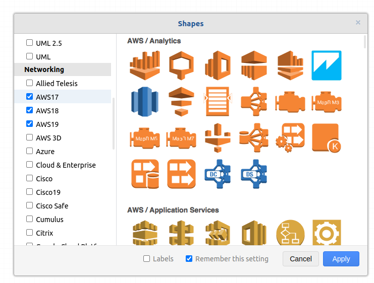
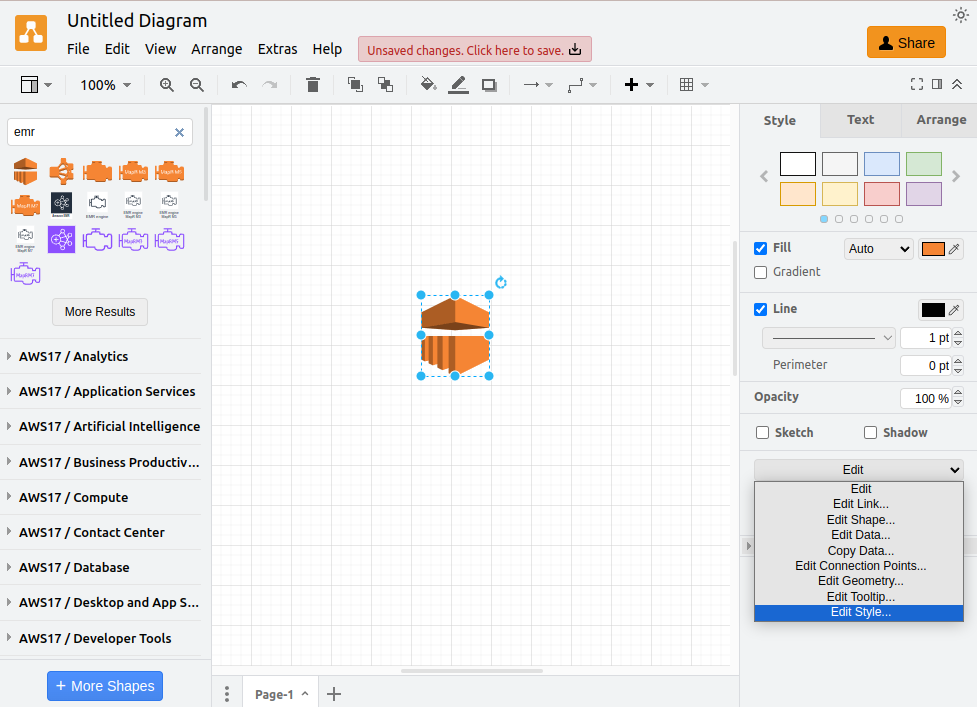

!!! note ""
    
    This page explains how the drawio processor analyzes the shape data to retrieve its `type`
    to be used as a value when mapping.

The basics of parsing Drawio diagrams and generating threat models is to categorize the 
shapes into their corresponding component type.

A wide variety of stencils are available at Drawio (even custom). 
The scope of this processor is to map a subset of these stencils as indicated below.

### Mapping of AWS Stencils

---
This AWS Stencils can be found under the Networking Section:

Every shape available at those stencils follows the same `style` structure.

Click Edit -> Edit Style...

The shape attribute has the information of which type this shape belongs.

For example: this shape can be categorized as `AWS EMR (Elastic MapReduce)`.

There are some exceptional cases where the `shape` attribute is not enough 
and an attribute equivalence has to be used to get the type.

| shape        | equivalence |
|--------------|-------------|
| group        | grIcon      |
| groupCenter  | grIcon      |
| resourceIcon | resIcon     |
| productIcon  | prIcon      |

For example, as the shape AWS SNS (Simple Notification Service) has the attribute `productIcon`, 
then the `prIcon` value will be used instead.

> As many components are repeated in different Stencils available and the only difference is the prefix mxgraph.aws[3/4],
> this prefix is simplified to aws. For example, the `prIcon=mxgraph.aws4.sns` is read as `shape_type: aws.sns`

### Mapping of mxGraph Stencils

---
Many other stencils at drawio use the previous logic of `shape=mxgraph.{group}.{type}` within their style 
which we can use to get the type.

When this info is available, the processor will read it and remove the `mxgraph.` prefix to set the `shape_type`.
For example, the `prIcon=mxgraph.android.phone2` is read as `shape_type: android.phone2`

