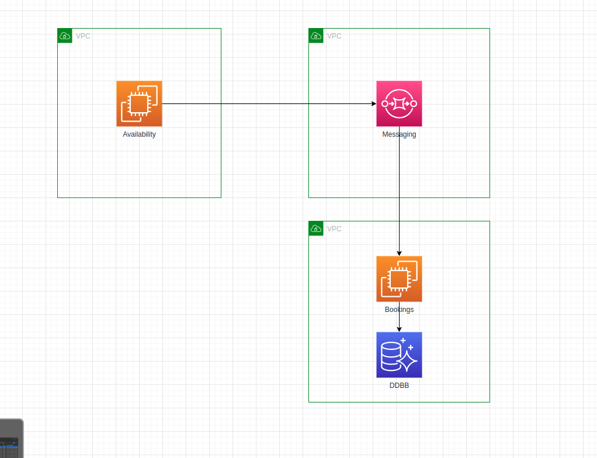
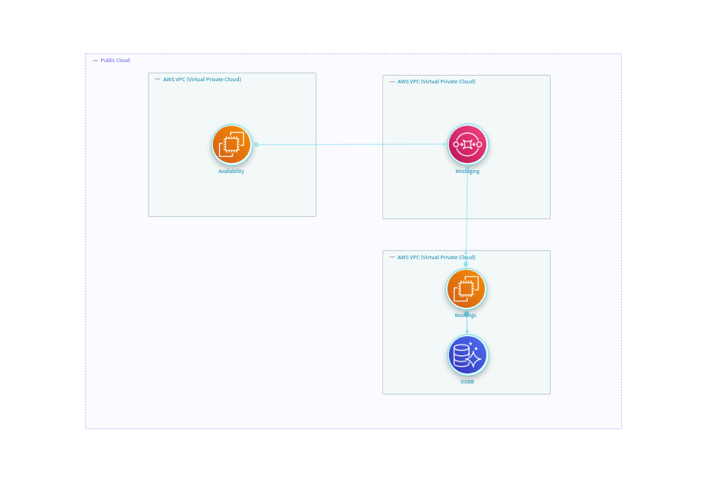

## What is Drawio?

---

[Drawio](https://www.drawio.com/) is a tool that enables its users to freely draw diagrams with generic or predefined shapes.

It is a common tool used by users for drawing an infrastructure or a threat model, so it is a candidate to convert into
an OTM Threat Model. Even though Drawio gives their users complete freedom to build whatever they want in the diagram, 
architecture or threat modeling diagrams tend to share a more or less common structure and StartLeft pretends to take 
advantage of this to automatize the processing of the diagrams to create threat models in the OTM format.


### Drawio Shapes
Drawio provides the users with predefined shapes that can be reused in every diagram. StartLeft is able to identify this kind of 
shapes so that their mappings can be also reused for converting different diagrams. This is the case, for example, of 
the
[Drawio AWS shapes](https://www.drawio.com/blog/aws-diagrams),
a library of reusable AWS components. This feature allows StartLeft clients
like [IriusRisk](https://iriusrisk.com) to define a 
[default mapping file with all these stencils](https://github.com/iriusrisk/startleft/blob/main/examples/drawio/iriusrisk-drawio-mapping.yaml) 
and send it in every request to StartLeft so the user could reuse this mapping file for every drawio file with predefined shapes
without the need to create one mapping file for each diagram.


## The `slp_drawio` module

---
The `slp_drawio` module is the StartLeft Processor responsible for converting Drawio files into OTM.
Although not every diagram is susceptible to be parsed into OTM automatically, the fact is that there are many
situations where the StartLeft process may be very useful.

### Mapping introduction
Its operation is based on two types of mapping files hierarchically processed, that is, <u>in case a shape is mapped
in both mapping files, the mapping in the custom mapping file has preference over the default one</u>:

* The **default mapping file** is expected to contain those mappings that may be potentially reused across different
  conversion requests. The typical use cases for this mapping file are predefined Drawio Shapes like the AWS ones
  mentioned before or another predefined shapes included in Drawio.
* The **custom mapping file** is the file where the user can introduce the mappings for their own specific
  components. As mentioned above, the user has absolute freedom to draw and name shapes that may be relevant for the
  threat model. <u>Only mapped shapes will be parsed into the OTM</u> so this is the place where you need to place the
  mappings for everything you want to be processed.

Regarding the usage of StartLeft to converting Drawio files,
you can check the manuals for the [REST API](../../../usage/REST-API.md).

## Accepted formats
---
You can parse drawio on both formats:

 - **_`*.drawio`_** The self Drawio file with the drawio extension
 - **_`*.xml`_** The XML exported from the Drawio tool with the xml extension


## A basic example

---
Suppose you have an architecture diagram like the one below, that contains some predefined AWS shapes: 
VPC, EC2, SQS and Aurora DB.



You may want to upload it to a threat modeling tool like [IriusRisk](http://iriusrisk.com) to build a threat model
like this:



The  reusable **default mapping file** that contains mappings for the AWS stencils, would be like this:
```yaml
trustzones:
  - label:  Public Cloud
    type:   b61d6911-338d-46a8-9f39-8dcd24abfe91
    default: true

components:
  - label: aws.vpc
    type: vpc
  - label: aws.aurora
    type: CD-AURORA
  - label: aws.sqs
    type: sqs-simple-queue-service
  - label: aws.ec2
    type: ec2
```

The result of sending to StartLeft this diagram with this default mapping file would be an OTM with all the components we
had in the original Drawio source:
<details>
  <summary>basic-drawio-example.otm</summary>

```json
{
  "otmVersion": "0.2.0",
  "project": {
    "name": "Drawio basic example",
    "id": "drawio-basic-example"
  },
  "representations": [
    {
      "name": "drawio-basic-example Diagram Representation",
      "id": "drawio-basic-example-diagram",
      "type": "diagram",
      "size": {
        "width": 1000,
        "height": 1000
      }
    }
  ],
  "trustZones": [
    {
      "id": "47",
      "name": "Public Cloud",
      "type": "b61d6911-338d-46a8-9f39-8dcd24abfe91",
      "risk": {
        "trustRating": 10
      }
    }
  ],
  "components": [
    {
      "id": "la1Y3zmRGmYUid53ubu8-1",
      "name": "VPC 1",
      "type": "vpc",
      "parent": {
        "trustZone": "47"
      }
    },
    {
      "id": "la1Y3zmRGmYUid53ubu8-2",
      "name": "Availability",
      "type": "ec2",
      "parent": {
        "component": "la1Y3zmRGmYUid53ubu8-1"
      }
    },
    {
      "id": "la1Y3zmRGmYUid53ubu8-3",
      "name": "VPC 2",
      "type": "vpc",
      "parent": {
        "trustZone": "47"
      }
    },
    {
      "id": "la1Y3zmRGmYUid53ubu8-4",
      "name": "Messaging",
      "type": "sqs-simple-queue-service",
      "parent": {
        "component": "la1Y3zmRGmYUid53ubu8-1"
      }
    },
    {
      "id": "la1Y3zmRGmYUid53ubu8-5",
      "name": "VPC 3",
      "type": "vpc",
      "parent": {
        "trustZone": "47"
      }
    },
    {
      "id": "la1Y3zmRGmYUid53ubu8-6",
      "name": "DDBB",
      "type": "CD-AURORA",
      "parent": {
        "component": "la1Y3zmRGmYUid53ubu8-5"
      }
    },
    {
      "id": "la1Y3zmRGmYUid53ubu8-2",
      "name": "Bookings",
      "type": "ec2",
      "parent": {
        "component": "la1Y3zmRGmYUid53ubu8-5"
      }
    }
  ],
  "dataflows": [
    {
      "id": "la1Y3zmRGmYUid53ubu8-10",
      "name": "",
      "source": "la1Y3zmRGmYUid53ubu8-7",
      "destination": "la1Y3zmRGmYUid53ubu8-6"
    },
    {
      "id": "la1Y3zmRGmYUid53ubu8-11",
      "name": "",
      "source": "la1Y3zmRGmYUid53ubu8-2",
      "destination": "la1Y3zmRGmYUid53ubu8-4"
    },
    {
      "id": "la1Y3zmRGmYUid53ubu8-13",
      "name": "",
      "source": "la1Y3zmRGmYUid53ubu8-4",
      "destination": "la1Y3zmRGmYUid53ubu8-7"
    }
  ]
}
```
</details>


### cURL

First of all, retrieve all the necessary files:

* Download the `drawio-basic-example.drawio` from [here](https://github.com/iriusrisk/startleft/blob/main/examples/drawio/drawio-basic-example.drawio).
* Save the default mapping above with the name `default-mapping.yaml`.


You can get the same result if through the StartLeft's REST API. For that, in first place we need to set up the
server with the command:
```shell
startleft server
```

If you want to run the server in a specific port, you can do:
```shell
startleft server -p 8080
```


Then, execute the following command to retrieve the OTM file:

```shell
curl --location --request POST localhost:5000/api/v1/startleft/diagram \
--header "Content-Type: multipart/form-data" \
--header "Accept: application/json" \
--form diag_type="DRAWIO" \
--form diag_file=@"./drawio-basic-example.drawio" \
--form default_mapping_file=@"./default-mapping.yaml" \
--form id="drawio-basic-example" \
--form name="Drawio Basic Example"
```

