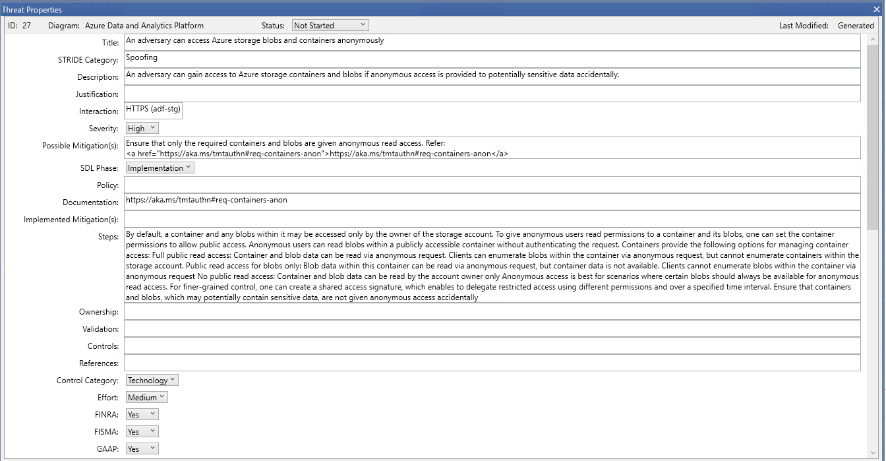

# MTMT mapping

---

A source mapping file (or 'mapping file' for short) describe how to identify components, dataflows, trust zones, 
threats and mitigations in source file and how to map them to the OTM equivalent.

Let's see howto identify the different elements:


## Trustzones
For the trust zones we need to write two fields: ``label`` and ``id``

The label will identify the MTMT trust zone by its type. 

Let's see an example with a trust zone in the MTMT_example.tm7


Our trustzone named ``Internet`` is of ``Generic Trust Border Boundary`` type.


So we need to put this
type in the label value.

The id in the mapping file will be the id in the OTM trust zone output

```yaml
  - label: Generic Trust Border Boundary
    id: 6376d53e-6461-412b-8e04-7b3fe2b397de
```

The trust zone OTM output will be:
```json
  {"trustZones": [
    {
      "id": "6376d53e-6461-412b-8e04-7b3fe2b397de",
      "name": "Internet",
      "risk": {
        "trustRating": 10
      },
      "properties": {
        "Name": "Internet"
      }
    }]}
```


## Components
For the components we need to write two fields: ``label`` and ``type``

The label will identify the MTMT component by its MTMT type. Let's see again the MTMT_example.tm7


Our ``Public API v2`` component is of ``Web API`` type.


So we need to put this type in the label value.

The ``type`` in the mapping file will be the type in the OTM component output.

```yaml
  - label: Web API
    type: web-service
```

The component OTM output will be:
```json
  {"components": [
    {
      "id": "5d15323e-3729-4694-87b1-181c90af5045",
      "name": "Public API v2",
      "type": "web-service",
      "parent": {
        "trustZone": "b61d6911-338d-46a8-9f39-8dcd24abfe91"
      },
      "properties": {
        "Name": "Public API v2"
      }
    }]}
```
As you can see, the OTM component name is coming from the custom name in the MTMT, in our case ``Public API v2``

### Mobile Client Component
The ``Mobile Client`` component is a special case that needs a little customization in the mapping file.


Because from the threat modeling point of view is not the same an Android than a iOS, we need
to know which type of component is based in its ``Mobile Client Tecnologies`` property configured in
the mapping file. Let's see how to do it:
```yaml
  - label: Mobile Client
    key: Mobile Client Technologies
    values:
      - value: Android
        type: android-device-client
      - value: iOS
        type: ios-device-client
```
- The ``label`` is the component type
- The ``key`` is the property of the component where we are going to extract the value
- The ``values`` is a map to convert from the MTMT ``value`` of the property to the OTM ``type``


## Dataflows
No need to be in the mapping file. StartLeft will detect them and will fill the OTM dataflow automatically detecting
the custom name, the source, and the destination

## Threats and Mitigations
No need to be in the mapping file.

StartLeft will extract OTM hreats and threat instances, as well as OTM mitigations
and mitigation instances from the same MTMT threat. Moreover the OTM component to which the OTM threat instance will be added
is the destination component from the MTMT threat.

Currently, Startleft maps threats and mitigations from two kind of templates:

### SDL TM Knowledge Base (Core) template
#### A MTMT threat


will be mapped to an OTM threat

```json
{
  "name": "Web Application Process Memory Tampered",
  "id": "30",
  "categories": [
    "Tampering"
  ],
  "risk": {
    "likelihood": 100,
    "impact": 100
  },
  "description": "If Web Application is given access to memory, such as shared memory or pointers, or is given the ability to control what Web Service executes (for example, passing back a function pointer.), then Web Application can tamper with Web Service"
}
```

to an OTM mitigation

```json
{
  "name": "Consider if the function could work with less access to memory, such as passing data rather than pointers",
  "id": "30",
  "riskReduction": 100,
  "description": "Consider if the function could work with less access to memory, such as passing data rather than pointers. Copy in data provided, and then validate it"
}
```

and also to an OTM threat instance along with its OTM mitigation instance, which will be mapped to the corresponding OTM component

```json
{
  "threat": "30",
  "state": "AutoGenerated",
  "mitigations": [
    {
      "mitigation": "30",
      "state": "RECOMMENDED"
    }
  ]
}
```

There is a special case when the MTMT threat has no ". Consider" pattern in the "Description" field. In such case, no OTM
mitigation nor OTM mitigation instance will be mapped, only the OTM threat and threat instance can be mapped.

### Azure Threat Model Template (AzureArchitecture) template
#### A MTMT threat without "Steps" field


will be mapped to an OTM threat

```json
{
  "name": "An adversary may read and/or tamper with the data transmitted to Azure Postgres DB due to weak configuration",
  "id": "1",
  "categories": [
    "Tampering"
  ],
  "risk": {
    "likelihood": 100,
    "impact": 100
  },
  "description": "An adversary may read and/or tamper with the data transmitted to Accounting PostgreSQL due to weak configuration"
}
```

to an OTM Mitigation

```json
{
  "name": "Enforce communication between clients and Azure Postgres DB to be over SSL/TLS by enabling the Enforce SSL connection feature on the server",
  "id": "1",
  "riskReduction": 100,
  "description": "Enforce communication between clients and Azure Postgres DB to be over SSL/TLS by enabling the Enforce SSL connection feature on the server. Check that the connection strings used to connect to MySQL databases have the right configuration (e.g. ssl = true or sslmode=require or sslmode=true are set). Refer: <a href=\"https://aka.ms/tmt-th154a\">https://aka.ms/tmt-th154a</a> Configure MySQL server to use a verifiable SSL certificate (needed for SSL/TLS communication). Refer: <a href=\"https://aka.ms/tmt-th154b\">https://aka.ms/tmt-th154b</a>"
}
```
#### A MTMT threat with "Steps" field


will be mapped to an OTM threat

```json
{
  "name": "An adversary can access Azure storage blobs and containers anonymously",
  "id": "27",
  "categories": [
    "Spoofing"
  ],
  "risk": {
    "likelihood": 100,
    "impact": 100
  },
  "description": "An adversary can gain access to Azure storage containers and blobs if anonymous access is provided to potentially sensitive data accidentally"
}
```

to an OTM mitigation

```json
{
  "name": "Ensure that only the required containers and blobs are given anonymous read access",
  "id": "27",
  "riskReduction": 100,
  "description": "By default, a container and any blobs within it may be accessed only by the owner of the storage account. To give anonymous users read permissions to a container and its blobs, one can set the container permissions to allow public access. Anonymous users can read blobs within a publicly accessible container without authenticating the request. Containers provide the following options for managing container access: Full public read access: Container and blob data can be read via anonymous request. Clients can enumerate blobs within the container via anonymous request, but cannot enumerate containers within the storage account. Public read access for blobs only: Blob data within this container can be read via anonymous request, but container data is not available. Clients cannot enumerate blobs within the container via anonymous request No public read access: Container and blob data can be read by the account owner only Anonymous access is best for scenarios where certain blobs should always be available for anonymous read access. For finer-grained control, one can create a shared access signature, which enables to delegate restricted access using different permissions and over a specified time interval. Ensure that containers and blobs, which may potentially contain sensitive data, are not given anonymous access accidentally"
}
```

and, in both cases, also to an OTM threat instance along with its OTM mitigation instance, which will be mapped to the corresponding OTM component


```json
{
  "threat": "27",
  "state": "AutoGenerated",
  "mitigations": [
    {
      "mitigation": "27",
      "state": "RECOMMENDED"
    }
  ]
}
```