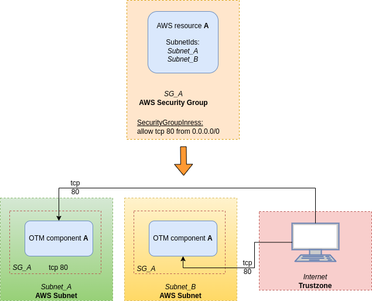
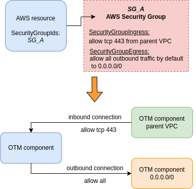
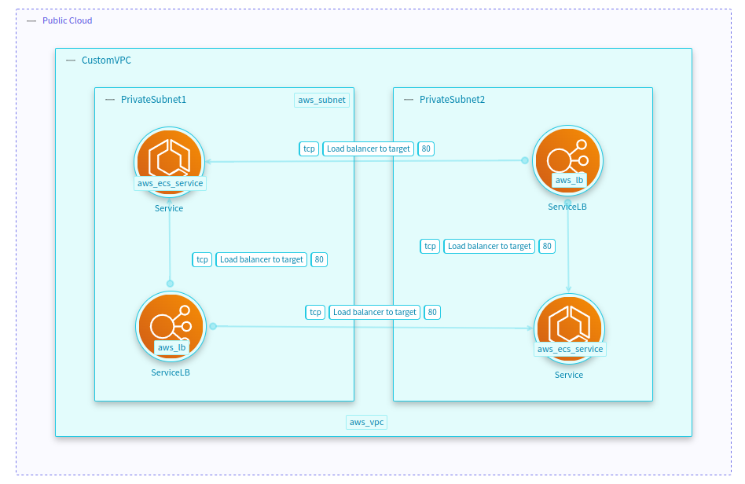

---

??? note "This mapping configuration only applies to Terraform Processor."
    
    Please refer to another mapping file configuration documentation if needed. 
    You can locate each processor's documentation in the left menu under the "StartLeft Processors (SLP)" section. 

>  :material-information-outline: Refer to [How To Map Dataflows](Terraform-how-mapping-file-works.md#how-to-map-dataflows) section for a simpler introduction.

---
!!! info
    In Terraform configuration files there not exist a direct relationship between resources and data flow.
    Mapping configuration is needed to be configured in the mapping file to represent its flows in the OTM.

## Types of dataflows in Terraform

---
### Simple dataflows
When dataflows mapping attribute has enough information, they are mapped directly through the mapping file.
It could be divided into three types:
#### resource A, **A**→**B**
The ```$source``` is the origin of the dataflow and has the information about the destination dataflow itself.

=== "Mapping file"

    ```yaml
    trustzones:
      - id:   public-cloud-01
        name: Public Cloud
        type: b61d6911-338d-46a8-9f39-8dcd24abfe91
        $default: true
    components:
      - type:        api-gateway
        $source:     {$type: "aws_api_gateway_authorizer"}
      - type:        cognito
        $source:     {$type: "aws_cognito_user_pool"}
    dataflows:
      - name:         {$format: "API gateway data flow from {resource_type}"}
        $source:      {$type: "aws_api_gateway_authorizer"}
        source:       {$path: "resource_id"}
        destination:  {$path: "resource_properties.provider_arns[0]"}
        tags:
          - API gateway dataflow
    ```
=== "Resource File"

    ```terraform
    resource "aws_cognito_user_pool" "user_pool" { }
    resource "aws_api_gateway_authorizer" "api_authorizer" {    
      provider_arns = [aws_cognito_user_pool.user_pool.arn]
    }
    ```
=== "OTM"

    ```yaml
    otmVersion: 0.1.0
    project:
      name: name
      id: id
    representations:
      - name: Terraform
        id: Terraform
        type: code
    trustZones:
      - id: b61d6911-338d-46a8-9f39-8dcd24abfe91
        name: Public Cloud
        risk:
          trustRating: 10
    components:
      - id: public-cloud-01.aws_api_gateway_authorizer-api_authorizer
        name: api_authorizer
        type: api-gateway
        parent:
          trustZone: b61d6911-338d-46a8-9f39-8dcd24abfe91
        tags:
          - aws_api_gateway_authorizer
      - id: public-cloud-01.aws_cognito_user_pool-user_pool
        name: user_pool
        type: cognito
        parent:
          trustZone: b61d6911-338d-46a8-9f39-8dcd24abfe91
        tags:
          - aws_cognito_user_pool
    dataflows:
      - id: 2ced6f2f-5eb9-4fa2-8417-beca148a6994
        name: API gateway data flow from aws_api_gateway_authorizer
        source: public-cloud-01.aws_api_gateway_authorizer-api_authorizer
        destination: public-cloud-01.aws_cognito_user_pool-user_pool
        tags:
          - API gateway dataflow
    ```

#### resource A, **singleton(A)**→**B**
The ```$source``` is the origin of the dataflow and has the information about the destination dataflow itself,
but the origin resource is mapped as a ```$singleton``` in the terraform file.

=== "Mapping file"

    ```yaml
    trustzones:
      - id:   public-cloud-01
        name: Public Cloud
        type: b61d6911-338d-46a8-9f39-8dcd24abfe91
        $default: true
    components:
      - type:        api-gateway
        $source:     {$singleton: {$type: {$regex: ^aws_api_gateway_\w*$}}}
      - type:        cognito
        $source:     {$type: "aws_cognito_user_pool"}
    dataflows:
      - name:         {$format: "API gateway data flow from {resource_type}"}
        $source:      {$type: "aws_api_gateway_authorizer"}
        source:       {$numberOfSources: {oneSource: {$path: "resource_id"}, multipleSource: {$format: "api-gateway (grouped)"}}}
        destination:  {$path: "resource_properties.provider_arns[0]"}
        tags:
          - API gateway dataflow
    ```
=== "Resource File"

    ```terraform
    resource "aws_api_gateway_rest_api" "rest_api" { }
    resource "aws_cognito_user_pool" "user_pool" { }
    resource "aws_api_gateway_authorizer" "api_authorizer" {    
      provider_arns = [aws_cognito_user_pool.user_pool.arn]
    }
    ```
=== "OTM"

    ```yaml
    otmVersion: 0.1.0
    project:
      name: name
      id: id
    representations:
      - name: Terraform
        id: Terraform
        type: code
    trustZones:
      - id: b61d6911-338d-46a8-9f39-8dcd24abfe91
        name: Public Cloud
        risk:
          trustRating: 10
    components:
      - id: public-cloud-01.aws_cognito_user_pool-user_pool
        name: user_pool
        type: cognito
        parent:
          trustZone: b61d6911-338d-46a8-9f39-8dcd24abfe91
        tags:
          - aws_cognito_user_pool
      - id: public-cloud-01.aws_api_gateway_rest_api-rest_api
        name: api-gateway (grouped)
        type: api-gateway
        parent:
          trustZone: b61d6911-338d-46a8-9f39-8dcd24abfe91
        tags:
          - rest_api (aws_api_gateway_rest_api)
          - api_authorizer (aws_api_gateway_authorizer)
    dataflows:
      - id: 3708e8b2-c593-4d4e-a2a6-a9861985ad12
        name: API gateway data flow from aws_api_gateway_authorizer
        source: public-cloud-01.aws_api_gateway_rest_api-rest_api
        destination: public-cloud-01.aws_cognito_user_pool-user_pool
        tags:
          - API gateway dataflow
    ```

#### resource A, **B**→**C**.
The ```$source``` has info to define a dataflow between two different resources.

=== "Mapping file"

    ```yaml
    trustzones:
      - id:   public-cloud-01
        name: Public Cloud
        type: b61d6911-338d-46a8-9f39-8dcd24abfe91
        $default: true
    components:
      - type:        s3
        $source:     {$type: "aws_s3_bucket"}
    dataflows:
      - name:         {$format: "S3 dataflow from {resource_type}"}
        $source:      {$type: "aws_s3_bucket_logging"}
        source:       {$path: "resource_properties.bucket" }
        destination:  {$path: "resource_properties.target_bucket"}
        tags:
          - $format: "Dataflow created by {resource_type}-{resource_name}"
    ```
=== "Resource File"

    ```terraform
    resource "aws_s3_bucket_logging" "logging" {
      bucket = aws_s3_bucket.bucket.id 
      target_bucket = aws_s3_bucket.log_bucket.id
    }
    resource "aws_s3_bucket" "bucket" { }
    resource "aws_s3_bucket" "log_bucket" { }
    ```
=== "OTM"

    ```yaml
    otmVersion: 0.1.0
    project:
      name: name
      id: id
    representations:
      - name: Terraform
        id: Terraform
        type: code
    trustZones:
      - id: b61d6911-338d-46a8-9f39-8dcd24abfe91
        name: Public Cloud
        risk:
          trustRating: 10
    components:
      - id: public-cloud-01.aws_s3_bucket-bucket
        name: bucket
        type: s3
        parent:
          trustZone: b61d6911-338d-46a8-9f39-8dcd24abfe91
        tags:
          - aws_s3_bucket
      - id: public-cloud-01.aws_s3_bucket-log_bucket
        name: log_bucket
        type: s3
        parent:
          trustZone: b61d6911-338d-46a8-9f39-8dcd24abfe91
        tags:
          - aws_s3_bucket
    dataflows:
      - id: 591089c3-9dc1-42c0-a574-3674f2d9deaf
        name: S3 dataflow from aws_s3_bucket_logging
        source: public-cloud-01.aws_s3_bucket-bucket
        destination: public-cloud-01.aws_s3_bucket-log_bucket
        tags:
          - Dataflow created by aws_s3_bucket_logging-logging
    ```

### Security Groups as dataflows

*After some analysis of the best way on how to implement Security Groups(as trustzones, components or dataflows), 
the final decision was to begin implementing them as dataflows, leaving for later a possible implementation in other ways.*

???+info "Scope of a Security Group"

    **If** a Threat Model is going to be generated from a Terraform file
    
    **and** the IaC file contains AWS resources
    
    **and** some of those AWS resources contains Security Groups information
    
    **and** this information is consistent and sufficient
    
    **then** there are AWS Security Groups that can be threat modeled as dataflows from the IaC file

    ---
    <figure markdown>
        
    </figure>

???info "Security Group referencing external IPs"

    **If** an AWS Security Group has got security group rules referencing an external IP
    
    **then** the resultant Threat Model will include an Internet trust zone
    
    **and** that trust zone will include a "generic terminal" component and this "generic terminal" component will be named as the external IP
    
    **and** this "generic terminal" component will be the origin or destination to all associated components to the SG.    

    === "Security Group Egress"
        <figure markdown>
            
        </figure>

    === "Security Group Ingress"
        <figure markdown>
            
        </figure>

#### A → SG_A → B
These are the dataflows that have only one Security Group between the two connected resources.

???+note "Security Group as dataflow type 1: A → SG_A → B"

    **If** an IaC resource is an AWS Security Group

    **and** has Security Group rules inside SecurityGroupIngress and/or SecurityGroupEgress data structures
    
    **and** there is an AWS resource with SecurityGroupIds containing the name of the AWS Security Group
    
    **then** the AWS resource is associated to that Security Group
    
    **and** the AWS resource will take from Security Group the rules to allow inbound or outbound connections

    <figure markdown>
        
    </figure>

=== "Mapping file"

    ```yaml
    trustzones:
      - id:   public-cloud-01
        name: Public Cloud
        type: b61d6911-338d-46a8-9f39-8dcd24abfe91
        $default: true
        
      - id:   f0ba7722-39b6-4c81-8290-a30a248bb8d9
        name: Internet
        type: f0ba7722-39b6-4c81-8290-a30a248bb8d9
        $source: {$singleton: {$type: "aws_security_group", $props: ["egress[0].cidr_blocks", "ingress[0].cidr_blocks"]}}
    components:
      - type:        vpc
        $source:     {$type: "aws_vpc"}
        
      - type:        empty-component
        $source:     {$type: "aws_subnet"}
        parent:      {$path: "resource_properties.vpc_id"}
        
      - type:        empty-component
        $source:     {$type: "aws_vpc_endpoint"}
        parent:      {$path: "resource_properties.subnet_ids"}
    
      - type:        generic-client
        name:        {$ip: {$path: "resource_properties.egress[0].cidr_blocks"}}
        $source:     {$type: "aws_security_group", $props: "egress[0].cidr_blocks"}
        parent:      f0ba7722-39b6-4c81-8290-a30a248bb8d9
        tags:
          - Outbound connection destination IP
    
      - type:        generic-client
        name:        {$ip: {$path: "resource_properties.ingress[0].cidr_blocks"}}
        $source:     {$type: "aws_security_group", $props: "ingress[0].cidr_blocks"}
        parent:      f0ba7722-39b6-4c81-8290-a30a248bb8d9
        tags:
          - Inbound connection source IP
          
    dataflows:
      - $source:      {$props: "security_group_ids"}
        source:       {$path: "resource_id"}
        destination:  {$hub: {$path: "resource_properties.security_group_ids"}}
        
      - $source:      {$type: "aws_security_group"}
        source:       {$path: "resource_properties.ingress[0].cidr_blocks"}
        destination:  {$hub: {$path: "resource_id"}}
        tags:
          - $path: "resource_properties.ingress[0].description"
          - $path: "resource_properties.ingress[0].protocol"
          - $path: "resource_properties.ingress[0].from_port|to_string(@)"
          - $path: "resource_properties.ingress[0].to_port|to_string(@)"
        
      - $source:      {$type: "aws_security_group"}
        source:       {$hub: {$path: "resource_id"}}
        destination:  {$path: "resource_properties.egress[0].cidr_blocks"}
        tags:
          - $path: "resource_properties.egress[0].description"
          - $path: "resource_properties.egress[0].protocol"
          - $path: "resource_properties.egress[0].cidr_blocks|join(',', @)"
    ```
=== "Resource File"

    ```terraform
    variable "vpcCidrblock" {
      default = ["10.0.0.0/16"]
    }  
    resource "aws_vpc" "CustomVPC" {
      cidr_block  = var.vpcCidrblock
    }
    resource "aws_subnet" "PrivateSubnet1" {
      vpc_id     = aws_vpc.CustomVPC.id
    }
    resource "aws_security_group" "VPCssmSecurityGroup" {
      vpc_id        = aws_vpc.CustomVPC.id
    
      ingress {
        cidr_blocks = var.vpcCidrblock
        from_port   = 443
        to_port     = 443
        protocol    = "tcp"
        description = "from CustomVPC:443"
      }
        
      egress {
        from_port   = 0
        to_port     = 0
        protocol    = "-1"
        cidr_blocks = ["0.0.0.0/0"]
        description = "Allow all outbound traffic by default"
      }
    }
    resource "aws_vpc_endpoint" "VPCssm" {
      security_group_ids = [
        aws_security_group.VPCssmSecurityGroup.id,
      ]
      subnet_ids = [
        aws_subnet.PrivateSubnet1.id
      ]
    }
    ```
=== "OTM"

    ```yaml
    otmVersion: 0.1.0
    project:
      name: name
      id: id
    representations:
      - name: Terraform
        id: Terraform
        type: code
    trustZones:
      - id: b61d6911-338d-46a8-9f39-8dcd24abfe91
        name: Public Cloud
        risk:
          trustRating: 10
      - id: f0ba7722-39b6-4c81-8290-a30a248bb8d9
        name: Internet
        risk:
          trustRating: 10
    components:
      - id: public-cloud-01.aws_vpc-customvpc
        name: CustomVPC
        type: vpc
        parent:
          trustZone: b61d6911-338d-46a8-9f39-8dcd24abfe91
        tags:
          - aws_vpc
      - id: public-cloud-01.aws_vpc-customvpc.aws_subnet-privatesubnet1
        name: PrivateSubnet1
        type: empty-component
        parent:
          component: public-cloud-01.aws_vpc-customvpc
        tags:
          - aws_subnet
      - id: public-cloud-01.aws_vpc-customvpc.aws_subnet-privatesubnet1.aws_vpc_endpoint-vpcssm
        name: VPCssm
        type: empty-component
        parent:
          component: public-cloud-01.aws_vpc-customvpc.aws_subnet-privatesubnet1
        tags:
          - aws_vpc_endpoint
      - id: f0ba7722-39b6-4c81-8290-a30a248bb8d9.aws_security_group-vpcssmsecuritygroup.0_0_0_0_0
        name: 0.0.0.0/0
        type: generic-client
        parent:
          trustZone: f0ba7722-39b6-4c81-8290-a30a248bb8d9
        tags:
          - Outbound connection destination IP
    dataflows:
      - id: 5173a0d7-a7dc-438a-a8a2-d310294f7698
        name: VPCssmSecurityGroup -> VPCssm
        source: public-cloud-01.aws_vpc-customvpc
        destination: public-cloud-01.aws_vpc-customvpc.aws_subnet-privatesubnet1.aws_vpc_endpoint-vpcssm
        tags:
          - from CustomVPC:443
          - tcp
          - "443"
          - "443"
      - id: 38306ec7-5db4-421c-9a74-13b2a30ca3f6
        name: VPCssm -> VPCssmSecurityGroup
        source: public-cloud-01.aws_vpc-customvpc.aws_subnet-privatesubnet1.aws_vpc_endpoint-vpcssm
        destination: f0ba7722-39b6-4c81-8290-a30a248bb8d9.aws_security_group-vpcssmsecuritygroup.0_0_0_0_0
        tags:
          - Allow all outbound traffic by default
          - "-1"
          - 0.0.0.0/0
    ```
=== "IriusRisk Threat Model Example"

    <figure markdown>
        
    </figure>

#### A → SG_A → SG_B → B
These are the dataflows that have two Security Groups between the two connected resources like this.

???+note "Security Group as dataflow type 2: A → SG_A → SG_B → B"

    **If** there is a Security Group that has ingress or egress data with other AWS Security Groups
    
    **and** both security groups have at least a resource associated to it
    
    **and** the resources are within different subnets
    
    **then** this Security Group will be threat modeled as dataflows between the resource of every subnet to the rest
    of resources of the other security group

    ---    
    <figure markdown>
        
    </figure>
    ---    

    *The resultant Threat Model is not a network but a TM of a network.*

    *If there are the same resources replicated in the Threat Model because there is more than a subnet, 
    applying the rest of business rules for SGs as dataflows, those dataflows will be generated consistently.*

    *What is threat modeled are the inbound and outbound connections from some components to other components, 
    not from the component to itself*

=== "Mapping file"

    ```yaml
    trustzones:
      - id:   public-cloud-01
        name: Public Cloud
        type: b61d6911-338d-46a8-9f39-8dcd24abfe91
        $default: true
    components:
      - type:        vpc
        $source:     {$type: "aws_vpc"}
    
      - type:        empty-component
        $source:     {$type: "aws_subnet"}
        parent:      {$path: "resource_properties.vpc_id"}
    
      - type:        empty-component
        $source:     {$type: "aws_vpc_endpoint"}
        parent:      {$path: "resource_properties.subnet_ids"}
    
      - type:        elastic-container-service
        $source:     {$type: "aws_ecs_service"}
        parent:      {$path:  "resource_properties.network_configuration[0].subnets"}
    
      - type:        load-balancer
        $source:     {$type: "aws_lb"}
        parent:      {$path: "resource_properties.subnets"}
    dataflows:
      - $source:      {$props: "security_groups"}
        source:       {$path: "resource_id"}
        destination:  {$hub: {$path: "resource_properties.security_groups"}}
        
      - $source:      {$props: "network_configuration | [0].security_groups"}
        source:       {$path: "resource_id"}
        destination:  {$hub: {$path: "resource_properties.network_configuration[0].security_groups"}}
    
      - $source:      {$type: "aws_security_group_rule",  $props: "type=='ingress'"}
        source:       {$hub: {$path: "resource_properties.source_security_group_id"}}
        destination:  {$hub: {$path: "resource_properties.security_group_id"}}
        tags:
          - $path: "resource_properties.description"
          - $path: "resource_properties.protocol"
          - $path: "resource_properties.from_port|to_string(@)"
          - $path: "resource_properties.to_port|to_string(@)"
    
      - $source:      {$type: "aws_security_group_rule",  $props: "type=='egress'"}
        source:       {$hub: {$path: "resource_properties.security_group_id"}}
        destination:  {$hub: {$path: "resource_properties.source_security_group_id"}}
        tags:
          - $path: "resource_properties.description"
          - $path: "resource_properties.protocol"
          - $path: "resource_properties.from_port|to_string(@)"
          - $path: "resource_properties.to_port|to_string(@)"
    ```
=== "Resource File"

    ```terraform
    resource "aws_vpc" "CustomVPC" {
      cidr_block  = "10.0.0.0/16"
    }
    resource "aws_subnet" "PrivateSubnet1" {
      vpc_id     = aws_vpc.CustomVPC.id
    }
    resource "aws_subnet" "PrivateSubnet2" {
      vpc_id     = aws_vpc.CustomVPC.id
    }
    resource "aws_security_group" "OutboundSecurityGroup" {
      vpc_id        = aws_vpc.CustomVPC.id
    }
    resource "aws_security_group" "ServiceLBSecurityGroup" {
      vpc_id        = aws_vpc.CustomVPC.id
    }
    resource "aws_security_group_rule" "OutboundSecurityGroupIngressfromServiceLBSecurityGroup" {
      type                      = "ingress"
      from_port                 = 80
      to_port                   = 80
      protocol                  = "tcp"
      security_group_id         = aws_security_group.OutboundSecurityGroup.id
      source_security_group_id  = aws_security_group.ServiceLBSecurityGroup.id
      description               = "Load balancer to target"
    }
    resource "aws_security_group_rule" "ServiceLBSecurityGroupEgresstoOutboundSecurityGroup" {
      type                      = "egress"
      from_port                 = 80
      to_port                   = 80
      protocol                  = "tcp"
      security_group_id         = aws_security_group.ServiceLBSecurityGroup.id
      source_security_group_id  = aws_security_group.OutboundSecurityGroup.id
      description               = "Load balancer to target"
    }
    resource "aws_ecs_service" "Service" {
      network_configuration {
        subnets = [aws_subnet.PrivateSubnet1.id, aws_subnet.PrivateSubnet2.id]
        security_groups = [aws_security_group.OutboundSecurityGroup.id]
      }
    }
    
    resource "aws_lb" "ServiceLB" {
      security_groups             = [aws_security_group.ServiceLBSecurityGroup.id]
      subnets                     = [aws_subnet.PrivateSubnet1.id, aws_subnet.PrivateSubnet2.id]
    }
    ```
=== "OTM"

    ```yaml
    otmVersion: 0.1.0
    project:
      name: name
      id: id
    representations:
      - name: Terraform
        id: Terraform
        type: code
    trustZones:
      - id: b61d6911-338d-46a8-9f39-8dcd24abfe91
        name: Public Cloud
        risk:
          trustRating: 10
    components:
      - id: public-cloud-01.aws_vpc-customvpc
        name: CustomVPC
        type: vpc
        parent:
          trustZone: b61d6911-338d-46a8-9f39-8dcd24abfe91
        tags:
          - aws_vpc
      - id: public-cloud-01.aws_vpc-customvpc.aws_subnet-privatesubnet1
        name: PrivateSubnet1
        type: empty-component
        parent:
          component: public-cloud-01.aws_vpc-customvpc
        tags:
          - aws_subnet
      - id: public-cloud-01.aws_vpc-customvpc.aws_subnet-privatesubnet2
        name: PrivateSubnet2
        type: empty-component
        parent:
          component: public-cloud-01.aws_vpc-customvpc
        tags:
          - aws_subnet
      - id: public-cloud-01.aws_vpc-customvpc.aws_subnet-privatesubnet1.aws_ecs_service-service
        name: Service
        type: elastic-container-service
        parent:
          component: public-cloud-01.aws_vpc-customvpc.aws_subnet-privatesubnet1
        tags:
          - aws_ecs_service
      - id: public-cloud-01.aws_vpc-customvpc.aws_subnet-privatesubnet2.aws_ecs_service-service
        name: Service
        type: elastic-container-service
        parent:
          component: public-cloud-01.aws_vpc-customvpc.aws_subnet-privatesubnet2
        tags:
          - aws_ecs_service
      - id: public-cloud-01.aws_vpc-customvpc.aws_subnet-privatesubnet1.aws_lb-servicelb
        name: ServiceLB
        type: load-balancer
        parent:
          component: public-cloud-01.aws_vpc-customvpc.aws_subnet-privatesubnet1
        tags:
          - aws_lb
      - id: public-cloud-01.aws_vpc-customvpc.aws_subnet-privatesubnet2.aws_lb-servicelb
        name: ServiceLB
        type: load-balancer
        parent:
          component: public-cloud-01.aws_vpc-customvpc.aws_subnet-privatesubnet2
        tags:
          - aws_lb
    dataflows:
      - id: 9e5be4ce-d37c-423e-9981-4dcb0b39c175
        name: ServiceLB -> Service
        source: public-cloud-01.aws_vpc-customvpc.aws_subnet-privatesubnet1.aws_lb-servicelb
        destination: public-cloud-01.aws_vpc-customvpc.aws_subnet-privatesubnet1.aws_ecs_service-service
        tags:
          - Load balancer to target
          - tcp
          - "80"
          - "80"
          - Load balancer to target
          - tcp
          - "80"
          - "80"
      - id: 92d467a9-6ee8-4f41-8d01-7fb0a6a5e06d
        name: ServiceLB -> Service
        source: public-cloud-01.aws_vpc-customvpc.aws_subnet-privatesubnet1.aws_lb-servicelb
        destination: public-cloud-01.aws_vpc-customvpc.aws_subnet-privatesubnet2.aws_ecs_service-service
        tags:
          - Load balancer to target
          - tcp
          - "80"
          - "80"
          - Load balancer to target
          - tcp
          - "80"
          - "80"
      - id: 2dfbd037-469a-4168-8388-e673f1190a3b
        name: ServiceLB -> Service
        source: public-cloud-01.aws_vpc-customvpc.aws_subnet-privatesubnet2.aws_lb-servicelb
        destination: public-cloud-01.aws_vpc-customvpc.aws_subnet-privatesubnet1.aws_ecs_service-service
        tags:
          - Load balancer to target
          - tcp
          - "80"
          - "80"
          - Load balancer to target
          - tcp
          - "80"
          - "80"
      - id: f04c37bf-3a01-40dd-a0cc-b438c840fa84
        name: ServiceLB -> Service
        source: public-cloud-01.aws_vpc-customvpc.aws_subnet-privatesubnet2.aws_lb-servicelb
        destination: public-cloud-01.aws_vpc-customvpc.aws_subnet-privatesubnet2.aws_ecs_service-service
        tags:
          - Load balancer to target
          - tcp
          - "80"
          - "80"
          - Load balancer to target
          - tcp
          - "80"
          - "80"
    ```
=== "IriusRisk Threat Model Example"

    <figure markdown>
        
    </figure>