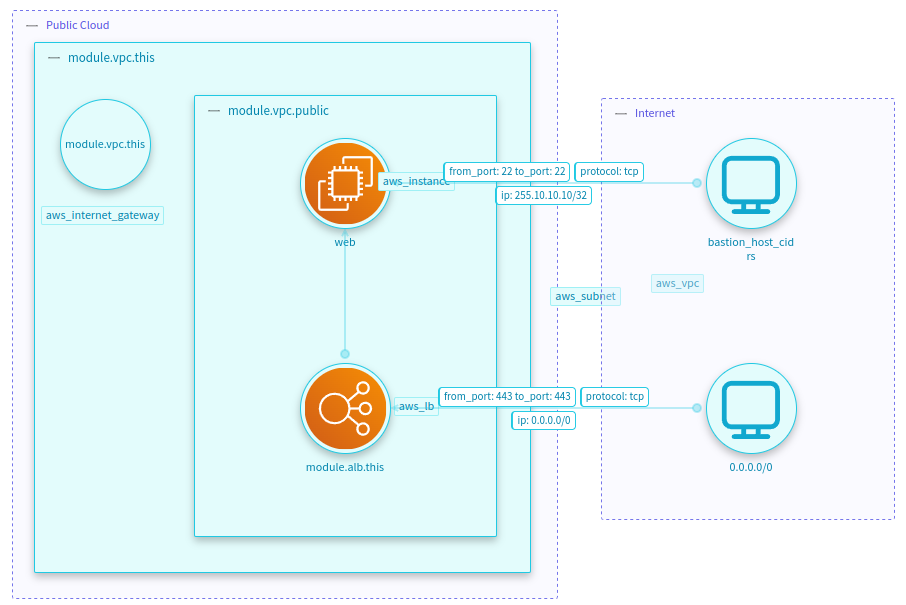

Attack Surface is the set of all the possible ways an attacker can enter or extract data from a system.
`Terraform Plan Processor` represents the attack surface as the set of all the resources that can be accessed 
by an attacker through the Internet.

## How it works?
Firstly, we need to configure the mapping file to define the attack surface behavior. You will find all the parameters 
required to enable this feature in the 
[Attack Surface Mapping Configuration](Terraform-Plan-how-to-create-a-mapping-file.md#attack-surface).
After enabling it, the processor will generate the `AttackSurface` retrieving all the `ingress` data
from the `Security Group Resources` and their rules.

## Example
Given the following Terraform files:

=== "main.tf"

    ```terraform
    module "vpc" {
      source  = "terraform-aws-modules/vpc/aws"
      version = "~> 5.0"
    
      name            = "VPC"
      cidr            = "10.0.0.0/16"
      azs             = ["eu-west-1a"]
      public_subnets  = ["10.0.10.0/24", "10.0.11.0/24"]
    
    }
    
    module "alb" {
      source  = "terraform-aws-modules/alb/aws"
      version = "8.1.0"
    
      name                       = "alb"
      load_balancer_type         = "application"
      vpc_id                     = module.vpc.vpc_id
      subnets                    = module.vpc.public_subnets
      security_groups            = [aws_security_group.alb.id]
      enable_deletion_protection = false
      idle_timeout               = 900
    }
    
    resource "aws_instance" "web" {
      ami           = "ami"
      instance_type = "t2.micro"
    
      count = "${length(module.vpc.public_subnets)}"
      subnet_id = "${element(module.vpc.public_subnets, count.index)}"
    
      launch_template {
        id      = aws_launch_template.web.id
        version = "$Latest"
      }
    }
    
    resource "aws_launch_template" "web" {
      name_prefix   = "tl-prefix"
      instance_type = "t2.micro"
      key_name      = "alt_web"
    
      network_interfaces {
        description                 = "primary interface"
        associate_public_ip_address = true
        delete_on_termination       = true
        device_index                = 0
        security_groups             = [aws_security_group.web.id]
      }
    }
    ```

=== "sg.tf"
    ```terraform

    resource "aws_security_group" "alb" {
      name        = "ALB SG"
      description = "Allow access traffic to ALB"
      vpc_id      = module.vpc.vpc_id
    }
    
    resource "aws_security_group_rule" "https-ingress" {
      security_group_id = aws_security_group.alb.id
      description       = "HTTPS access from the world"
    
      type      = "ingress"
      from_port = 443
      to_port   = 443
      protocol  = "tcp"
    
      cidr_blocks = ["0.0.0.0/0"]
    }
    
    resource "aws_security_group" "web" {
      name        = "Web SG"
      description = "Allow access HTTP and SSH traffic to aws instance"
      vpc_id      = module.vpc.vpc_id
    
      ingress {
        description = "SSH access from bastion host"
        from_port   = 22
        to_port     = 22
        protocol    = "tcp"
        cidr_blocks = [var.bastion_host_cidrs]
      }
    
      ingress {
        description     = "HTTP access from ALB"
        from_port       = 8080
        to_port         = 8080
        protocol        = "tcp"
        security_groups = [aws_security_group.alb.id]
      }
      
    }
    ```


=== "main.tfvars"

    ```terraform
    bastion_host_cidrs = "255.10.10.10/32"
    ```

=== "variables.tf"

    ```terraform
    variable "bastion_host_cidrs" {}
    ```

The `Terraform Plan Processor` will generate the following `Attack Surface`:

=== "IriusRisk Threat Model Example"

    <figure markdown>
        
    </figure>

=== "OTM"
    
    ```yaml
    otmVersion: 0.1.0
    project:
      name: Attack Surface
      id: attack-surface
    representations:
      - name: Terraform
        id: Terraform
        type: code
    trustZones:
      - id: b61d6911-338d-46a8-9f39-8dcd24abfe91
        name: Public Cloud
        risk:
          trustRating: 10
      - id: f0ba7722-39b6-4c81-8290-a30a248bb8d9
        name: Internet
        risk:
          trustRating: 1
    components:
      - id: aws_instance.web
        name: web
        type: ec2
        parent:
          component: module.vpc.aws_subnet.public
        tags:
          - aws_instance
      - id: module.alb.aws_lb.this
        name: module.alb.this
        type: load-balancer
        parent:
          component: module.vpc.aws_subnet.public
        tags:
          - aws_lb
      - id: module.vpc.aws_internet_gateway.this
        name: module.vpc.this
        type: empty-component
        parent:
          component: module.vpc.aws_vpc.this
        tags:
          - aws_internet_gateway
      - id: module.vpc.aws_subnet.public
        name: module.vpc.public
        type: empty-component
        parent:
          component: module.vpc.aws_vpc.this
        tags:
          - aws_subnet
      - id: module.vpc.aws_vpc.this
        name: module.vpc.this
        type: vpc
        parent:
          trustZone: b61d6911-338d-46a8-9f39-8dcd24abfe91
        tags:
          - aws_vpc
      - id: b0a3f48b-e876-4903-9931-31a1c7e29c17
        name: 0.0.0.0/0
        type: generic-client
        parent:
          trustZone: f0ba7722-39b6-4c81-8290-a30a248bb8d9
      - id: 0810be7c-0673-478c-95d4-44803b835917
        name: bastion_host_cidrs
        type: generic-client
        parent:
          trustZone: f0ba7722-39b6-4c81-8290-a30a248bb8d9
    dataflows:
      - id: 81dc59db-dbd4-41a5-bc5f-42e56e655f32
        name: module.alb.this to web
        source: module.alb.aws_lb.this
        destination: aws_instance.web
        bidirectional: false
      - id: 31292a10-47b0-4e2d-b172-c150eeca66a8
        name: HTTPS access from the world
        source: b0a3f48b-e876-4903-9931-31a1c7e29c17
        destination: module.alb.aws_lb.this
        bidirectional: false
        tags:
          - "protocol: tcp"
          - "from_port: 443 to_port: 443"
          - "ip: 0.0.0.0/0"
      - id: 9cdc7ad0-253f-44d3-9f7c-548fb19a42fc
        name: SSH access from bastion host
        source: 0810be7c-0673-478c-95d4-44803b835917
        destination: aws_instance.web
        bidirectional: false
        tags:
          - "protocol: tcp"
          - "from_port: 22 to_port: 22"
          - "ip: 255.10.10.10/32"
    ```
