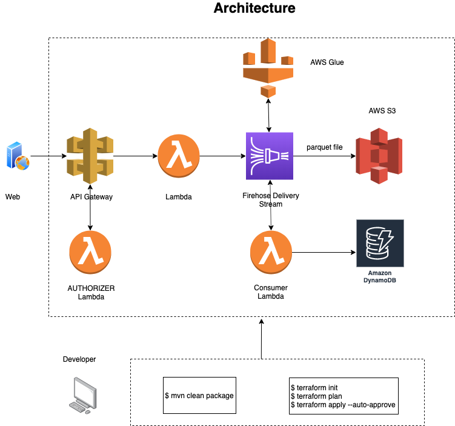
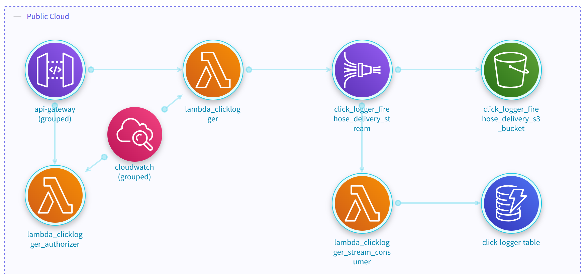

## Threat Model Architecture Representation

Let's use an Official example for 
<a href="https://github.com/aws-samples/aws-ingesting-click-logs-using-terraform" target="_blank">
Ingesting Web Application Click Logs</a>:

> This post provides an API based ingestion application system for websites & applications to push user interactions, 
> click actions from their website into AWS. The ingestion process will be exposed using a web-based interaction with an API Gateway endpoint.

This example gives the source code for the following AWS architecture diagram:



The `slp_tfplan` processor can generate an accurate threat model by only following the steps below.

???+ abstract "Generating my own Terraform files"

    :one: Clone and prepare the example reporitory:
    > :material-information-outline: These previous set-up commands are required because the example needs some 
    > lambda code to be compiled.
    
    ```shell 
    $ git clone https://github.com/aws-samples/aws-ingesting-click-logs-using-terraform.git
    $ cd aws-ingesting-click-logs-using-terraform/source/clicklogger
    $ mvn clean package
    $ cd ../../terraform/templates
    ```
    
    :two: Generate the tf-plan and tf-graph files:
    ```shell
    $ terraform init
    $ terraform plan -out=tf-plan
    $ terraform show -json tf-plan > tf-plan.json
    $ terraform graph -type=plan -plan=tf-plan > tf-graph.gv
    ```
    
Use the StartLeft CLI to generate the OTM file:
```shell
$ startleft parse \ 
  --iac-type TFPLAN \ 
  --mapping-file ir-mappings.yaml \ 
  --output-file output.otm \
  --project-id "my-project" \
  --project-name "My project" \ 
  tf-plan.json tf-graph.gv
```

After, we need to use the Terraform CLI to create the required files and execute StartLeft parse to generate the
final OTM.

=== "IriusRisk Threat Model Example"

    <figure markdown>
        
    </figure>

=== "Mapping file"

    ```yaml
    --8<-- "examples/tfplan/iriusrisk-tfplan-aws-mapping.yaml"
    ```
=== "OTM"

    ```yaml
    otmVersion: 0.1.0
    project:
      name: name
      id: id
    representations:
      - name: Terraform
        id: Terraform
        type: code
    trustZones:
      - id: b61d6911-338d-46a8-9f39-8dcd24abfe91
        name: Public Cloud
        risk:
          trustRating: 10
    components:
      - id: aws_dynamodb_table.click-logger-table
        name: click-logger-table
        type: dynamodb
        parent:
          trustZone: b61d6911-338d-46a8-9f39-8dcd24abfe91
        tags:
          - aws_dynamodb_table
      - id: aws_kinesis_firehose_delivery_stream.click_logger_firehose_delivery_stream
        name: click_logger_firehose_delivery_stream
        type: kinesis-data-firehose
        parent:
          trustZone: b61d6911-338d-46a8-9f39-8dcd24abfe91
        tags:
          - aws_kinesis_firehose_delivery_stream
      - id: aws_lambda_function.lambda_clicklogger
        name: lambda_clicklogger
        type: aws-lambda-function
        parent:
          trustZone: b61d6911-338d-46a8-9f39-8dcd24abfe91
        tags:
          - aws_lambda_function
      - id: aws_lambda_function.lambda_clicklogger_authorizer
        name: lambda_clicklogger_authorizer
        type: aws-lambda-function
        parent:
          trustZone: b61d6911-338d-46a8-9f39-8dcd24abfe91
        tags:
          - aws_lambda_function
      - id: aws_lambda_function.lambda_clicklogger_stream_consumer
        name: lambda_clicklogger_stream_consumer
        type: aws-lambda-function
        parent:
          trustZone: b61d6911-338d-46a8-9f39-8dcd24abfe91
        tags:
          - aws_lambda_function
      - id: aws_s3_bucket.click_logger_firehose_delivery_s3_bucket
        name: click_logger_firehose_delivery_s3_bucket
        type: s3
        parent:
          trustZone: b61d6911-338d-46a8-9f39-8dcd24abfe91
        tags:
          - aws_s3_bucket
      - id: aws_api_gateway_account.click_logger_api_gateway_account
        name: api-gateway (grouped)
        type: api-gateway
        parent:
          trustZone: b61d6911-338d-46a8-9f39-8dcd24abfe91
        tags:
          - aws_api_gateway_method_response
          - aws_api_gateway_method_settings
          - aws_api_gateway_integration_response
          - aws_api_gateway_method
          - aws_api_gateway_model
          - aws_api_gateway_request_validator
          - aws_api_gateway_integration
          - aws_api_gateway_account
          - aws_api_gateway_resource
          - aws_api_gateway_rest_api
          - aws_api_gateway_authorizer
          - aws_api_gateway_deployment
      - id: aws_cloudwatch_log_group.click_logger_firehose_delivery_stream_log_group
        name: cloudwatch (grouped)
        type: cloudwatch
        parent:
          trustZone: b61d6911-338d-46a8-9f39-8dcd24abfe91
        tags:
          - aws_cloudwatch_log_group
    dataflows:
      - id: cb8953f8-1436-47a6-8939-ffcd07902614
        name: clicklogger-authorizer to lambda_clicklogger_authorizer
        source: aws_api_gateway_account.click_logger_api_gateway_account
        destination: aws_lambda_function.lambda_clicklogger_authorizer
        bidirectional: false
      - id: 4f25e0b3-0b8a-4e84-90db-f0a8de34467e
        name: integration to lambda_clicklogger
        source: aws_api_gateway_account.click_logger_api_gateway_account
        destination: aws_lambda_function.lambda_clicklogger
        bidirectional: false
      - id: 66cecdff-ba09-42b1-a75f-8e98fdae2dc4
        name: lambda_click_logger_authorizer_log_group to lambda_clicklogger_authorizer
        source: aws_cloudwatch_log_group.click_logger_firehose_delivery_stream_log_group
        destination: aws_lambda_function.lambda_clicklogger_authorizer
        bidirectional: false
      - id: e01769b2-d461-4c4d-b7aa-cc028f4533ab
        name: lambda_click_logger_log_group to lambda_clicklogger
        source: aws_cloudwatch_log_group.click_logger_firehose_delivery_stream_log_group
        destination: aws_lambda_function.lambda_clicklogger
        bidirectional: false
      - id: 9618b94c-b899-45d0-ba70-61d141e2ad54
        name: click_logger_firehose_delivery_stream to lambda_clicklogger_stream_consumer
        source: aws_kinesis_firehose_delivery_stream.click_logger_firehose_delivery_stream
        destination: aws_lambda_function.lambda_clicklogger_stream_consumer
        bidirectional: false
      - id: e4431bbb-a8d5-413e-be2b-8c5b0cc06d81
        name: click_logger_firehose_delivery_stream to
          click_logger_firehose_delivery_s3_bucket
        source: aws_kinesis_firehose_delivery_stream.click_logger_firehose_delivery_stream
        destination: aws_s3_bucket.click_logger_firehose_delivery_s3_bucket
        bidirectional: false
      - id: 3c58eb54-f1eb-4762-9f2b-dd88793032e3
        name: lambda_clicklogger to click_logger_firehose_delivery_stream
        source: aws_lambda_function.lambda_clicklogger
        destination: aws_kinesis_firehose_delivery_stream.click_logger_firehose_delivery_stream
        bidirectional: false
      - id: 50058e60-209a-4a2f-99b3-066bb633e2eb
        name: lambda_clicklogger_stream_consumer to click-logger-table
        source: aws_lambda_function.lambda_clicklogger_stream_consumer
        destination: aws_dynamodb_table.click-logger-table
        bidirectional: false
    ```

As we can see in the previous example, StartLeft can automatically reproduce an almost exact architecture diagram than the one present in the example website.

## Full Architecture Representation
This approach enables StartLeft not only to create threat models but also to explore all the components and the dataflows among them, 
by configuring this behavior in the mapping file. In that way, you can get this diagram from the example above:

=== "IriusRisk Threat Model Example"

    <figure markdown>
        
    </figure>

=== "Mapping file"
    
    > The following configuration needs to be added in the mapping file to enable this feature. 

    ```yaml
    configuration:
      skip:
        - aws_security_group
        - aws_internet_gateway
        - aws_db_subnet_group
      catch_all: empty-component
    ```