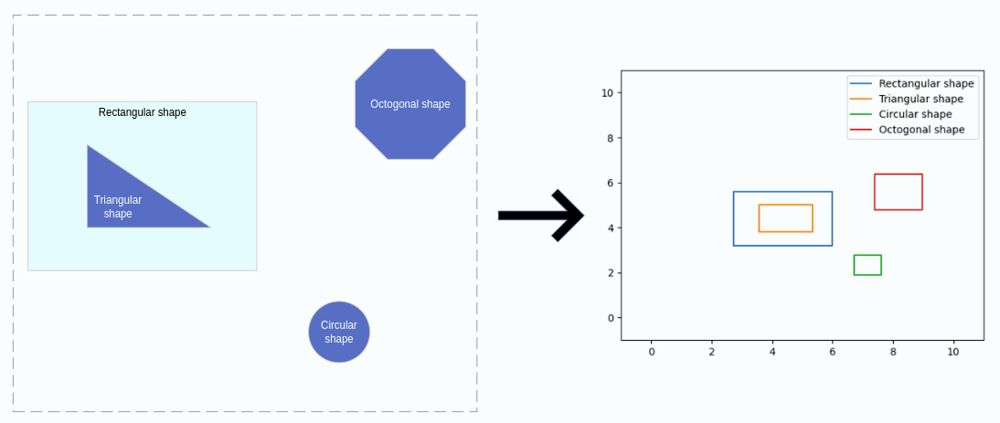

# Visio TrustZones Mapping

---
## Visio shapes context

---
Trustzones in a Visio diagram can be represented in different ways and, in any of them, it does not exist a perfect 
method to unambiguously identify the TrustZone to which a component belongs. This page pretends to clarify the 
different 
mechanisms used by startleft to identify TrustZones and assign components to them during the Visio diagram parsing 
to an Open Threat Model (OTM).

### Use of shapely Polygons
Visio diagrams only has two ways to relate shapes:
* **Connectors between shapes**, that are used to create OTM dataflows.

<p align="center"></p>

* **Grouped shapes**. This may be useful in some circumstances, but grouping shapes is a decision of the person that is 
 creating the diagram, so we cannot trust on that to perform generic processing.

<p align="center"></p>

These two features are not enought for the processings we need to do. Along this document, we will see that we need to 
identify relationships between the shapes (inheritance, zones definition, etc.). For that reason, at the moment of 
loading the Visio diagram, we use the Visio library `shapely` to create a simplified representation of each shape, so we 
can then perform more or less complex operation with that representation model.

This would be an example of a Visio diagram and the simplified model we generate:

<p align="center"></p>

The shapely object we use for the Visio shapes representation is the Polygon and an extensive manual of how to manipulate 
that objects can be found [here](https://shapely.readthedocs.io/en/stable/manual.html).

## TrustZone identification

---
We have two ways to identify TrustZones in a Visio diagram that are described below. However, it is important to notice 
that, regardless the type of TrustZone calculation, **no TrustZone will be included in the OTM if it does not appear in 
the mapping file**. If some TrustZone candidate is identified in the Visio diagram, but it is not in the mapping file, 
the TrustZone will be ignored or processed as a normal component depending on the case.

### Parent Shape TrustZone
**One shape that has no parent in the Visio diagram and that appears in the mapping file is considered a TrustZone**. 
It is the case of this example:
<p align="center"></p>

The TrustZone identification is based on the parent calculation. Notice that a component may belong directly to a 
TrustZone, but also be nested into another component. Anyway, each shape must have a parent, so, for each of them, we 
perform the following steps:

1. We check if the shape is contained into another. If so, that shape is its parent.
2. If a shape is not contained in any other, there are two options:
   1. If it is mapped as a TrustZone in the mapping file, it is a TrustZone.
   2. If not, it is a component whose parent is the default TrustZone.

As stated before, Visio does not provide information about if a shape is over or “belongs to“ another one. To solve this, 
we use the shapely’s `Polygon` representations of each shape. For each shape, we check if it is contained in another one 
by using the shapely’s `Polygon`'s function `contains(Polygon) -> bool`. This function let us know if some shape contains 
another.

#### Nested components
Nested components are a special case where more than one shapes will return True when calling the `contains` function.
<p align="center"></p>

In the example above, the `Public Cloud` and `Custom VPC` contain the `Some ec2` shape. In this case we use the `Polygon`'s 
function area. The parent shape is the one with the smallest area, that is, the `Custom VPC`. Then, the Custom VPC is only 
contained in the `Public Cloud`, so it is selected as its parent. Finally, the `Public Cloud` is not contained by any 
shape, and it is mapped as TrustZone in the mapping file, so it is converted into one.

### Boundary TrustZone
> **Note**: The tangent would be more precise than the secant, but given its center point is more difficult from the Visio 
> data, so we use the secant, whose calculations should be also valid for other types or arcs, like elliptical ones.

Boundaries are the most common way to delimite TrustZones in a threat model. However, their graphic representation is 
more lax than the nested shapes, because they simply use arcs to define zones in the diagram. For example:
<p align="center"></p>

In this case, we need to use the arcs that define the boundaries to generate different zones in the diagram  and then 
check the shapes that belong to those zones. Anyway, do not forget that, **if a TrustZone is not in the mapping file, it 
will not be generated. In case of boundary TrustZones, they will be simply ignored**.

#### Supported types of arcs
> **Note**: <u>This is a relevant limitation</u>.

There are several types of shapes that could be used to determine boundaries in the diagram, and we will need to evolve 
StartLeft to support them. **Currently, we only support the Curved shape Visio type to process TrustZones**.
It may be evolved in the future in order to include more types of connectors.

#### Zones calculation
To build the diagram zones from the arc shapes, we generate internal components based on the intersection of the secant 
of the boundary arcs with the diagram limits:
<p align="center"></p>

**Once we have these special zone components calculated, they are inserted in the usual parent calculation process 
described above**. However, there are two particularities with them:
1. A zone component can only be mapped to a TrustZone. If there is no TrustZone to match it in the mapping file, it is 
simply ignored and not transformed in a normal component.
2. If two zone components are overlapped and a shape belongs to both, we cannot use here the area criteria to decide 
   because it is not relevant. Instead of it, we use the shapely `Polygon`'s function centroid,  that returns a `Point` 
   representing the center of the generated component. Then we also get the center of the child shape and, using the
   `Point`'s `distance` function, we choose the zone whose center is closer to the shape’s one.

##### <u>Zone component building details</u>
> **TL;DR**: This is a very low level section, feel free to skip it if you want, since the more relevant info about 
> TrustZone mappings can be understood without this level of detail.

To build the zone components, we use three properties of the Visio arc shape (aka. _Curved panel_):
* `Shape/Cell['PinX']`: X coordinate of the center of the arc shape.
* `Shape/Cell['PinY']`: Y coordinate of the center of the arc shape.
* `Shape/Cell['Angle']`: Angle of rotation of the shape.

Represented in Visio, these properties would be:

<p align="center"></p>

Apart from this data, during the main parsing process of the shapes, we keep track of its position in order to calculate 
the borders of the diagrams, that are essential for the calculations described below.

**<u>Angle normalization</u>**

The first step of the process is translating the Visio angle from the [-pi, pi] range to (0, 2pi] to simplify further 
calculations using the following expression:
`angle = angle + 2*pi if angle < 0`
> **Note**: Notice that Visio angles are given in radians and so they are processed in Startleft.

Once we have the angle normalized, there are two possible cases. The first one is when we have a perfectly vertical or 
horizontal secant. In this case, we will build a quadrant component (the _Private Secured Cloud_ on the first example of 
this section). The second case is when the secant is sloped with a certain angle, and we need to calculate the 
intersection used the formula of the line (the other two cases in the example).


**<u>Quadrant building</u>**
   
This is the simpliest case. We only have to know the orientation of the arc and then build the quadrant based on 
the X or Y value depending on the case. The correspondences between the four possible orientations and the 
normalized Visio angle are the following:
* **UPPER**: pi / 4 radians
* **LOWER**:  (5 / 4) * pi radians
* **LEFT**: (3 / 4) * pi radians
* **RIGHT**: (7 / 4) * pi radians

For each of these orientations, we have a function to determine the points of the `Polygon` we have to build:
* **UPPER**: `[(x_floor, y), (x_floor, y_top), (x_top, y_top), (x_top, y)]` 
* **LOWER**: ` [(x_floor, y_floor), (x_floor, y), (x_top, y), (x_top, y_floor)])` 
* **LEFT**: `[(x_floor, y_floor), (x_floor, y_top), (x, y_top), (x, y_floor)])` 
* **RIGHT**: `[(x, y_floor), (x, y_top), (x_top, y_top), (x_top, y_floor)])` 

**<u>Irregular zone building</u>**

In this case we have to calculate the formula of the secant line in order to calculate the point of intersection 
with the borders of the diagram. For that, the first step is getting the line angle. Notice that it is different to 
the Visio shape angle. For example, in the previous arc figure, the shape angle is pi/4 radians and the secant 
angle is 0 radians. To get the real angle, we need to perform the following calculation:

```python
def calc_slope_angle(angle):
    slope_angle = angle - pi / 4

    if slope_angle < 0:
        slope_angle = slope_angle + 2 * pi
    if slope_angle > pi:
        slope_angle = slope_angle - pi

    return slope_angle
```

Then, we calculate the slope with the tangent: `slope = tan(slope_angle)`

Once we have the slope and some point (the `PinX`, `PinY` coordinates), we already can calculate the formulas for 
getting the Y value from the X and viceversa.

```python
def calc_y_formula(slope: float, any_line_point: tuple):
    return lambda x: x * slope - any_line_point[0] * slope + any_line_point[1]


def calc_x_formula(slope: float, any_line_point: tuple):
    return lambda y: y / slope + any_line_point[0] - (any_line_point[1] / slope)
```

From this point on, the process is similar to the quadrant. In first place, we need to determine the orientation of the arc:
* **UPPER_LEFT**: `pi / 4 <= angle <= (3 / 4) * pi` 
* **UPPER_RIGHT**: `0 <= angle <= pi / 4 or (7 / 4) * pi <= angle <= 2 * pi` 
* **LOWER_LEFT**: `(3 / 4) * pi <= angle <= (5 / 4) * pi` 
* **LOWER_RIGHT**: `(5 / 4) * pi <= angle <= (7 / 4) * pi`

With the orientation and the x and y formulas, we already have all the necessary to build the `Polygon` from the 
intersection of the line with the diagram borders. In this case, the functions are a little more complex because, 
depending on how big the diagram is and what is the angle of the arc, the zone can be a triangle or a quadrilateral.
To keep this document simpler, the functions are omitted, but they can be checked out in the `slp_visio`’s 
`irregular_zones.py` file.

## Limitations

---
Currently, there are a couple of significant limitations to take into account regarding the trustzone identification:

* In boundary TrustZones, if a shape is located between the secant and the arc itself, it is not considered part of 
the TrustZone.
* We only support Visio’s Curved Panel to process boundary TrustZones.